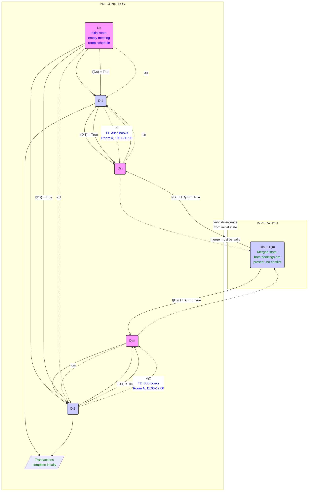
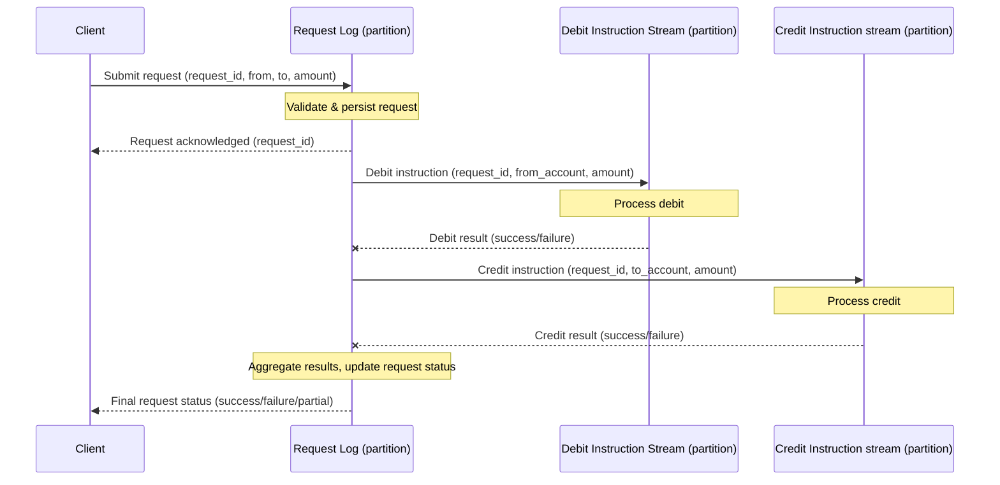
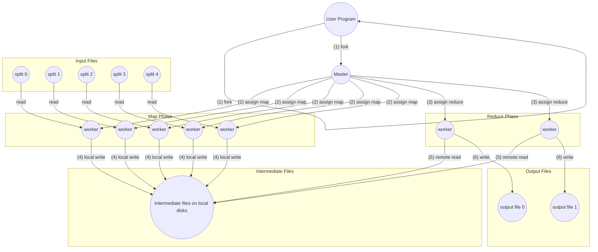
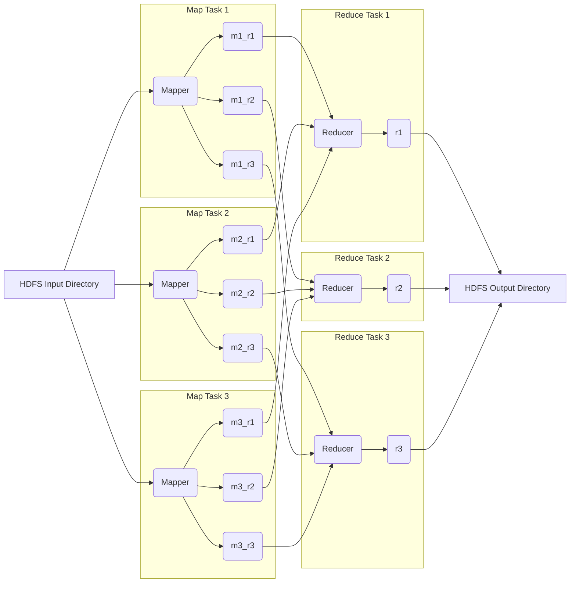

# System Design

## Table of Contents

- [Feature Sets](#feature-sets)
- [Interfaces](#interfaces)
- [Class Hierarchies](#class-hierarchies)
- [Distributed Systems](#distributed-systems)
- [Designing a System under Certain Constraints](#designing-a-system-under-certain-constraints)
- [Simplicity](#simplicity)
- [Limitations](#limitations)
- [Robustness](#robustness)
- [Tradeoffs](#tradeoffs)
- [How the Internet Works](#how-the-internet-works)
    - [Routers](#routers)
    - [Domain Name Servers](#domain-name-servers)
    - [Load Balancers](#load-balancers)
    - [Firewalls](#firewalls)
- [Traversing a Graph](#traversing-a-graph)
- [Run-time Complexity of Graphs](#run-time-complexity-of-graphs)
- [A Distributed Hash Table System](#a-distributed-hash-table-system)
- [Resource Estimation with Real Systems](#resource-estimation-with-real-systems)
- [The Big Product Design Picture](#the-big-product-design-picture)
- [Translation of an Abstract Problem to a System](#translation-of-an-abstract-problem-to-a-system)
- [API Discussions](#api-discussions)
- [Binary Trees](#binary-trees)
- [Cache](#cache)
- [MapReduce](#mapreduce)
- [For Loop Problems](#for-loop-problems)
- [Index](#index)
- [Reverse Linked List](#reverse-linked-list)
- [Compilers](#compilers)
- [Memory Cache](#memory-cache)
- [Networks](#networks)

## Feature Sets

## Interfaces

## Class Hierarchies

## Distributed Systems

## Designing a System under Certain Constraints

Let's start with a summary of what eventual consistency is and what its limitations are. Eventually consistent systems in the style of Amazon Dynamo are designed to be fast and highly available during failures, even when parts of the system fail. We're guaranteed that all copies of data will converge to the same state at some future point. However, this puts the burden of handling temporary inconsistencies on the application. Here are some examples of guarantees that eventual consistency can't provide:

- *Key uniqueness*: If we can't guarantee uniqueness of email addresses registered with accounts, one email address may get attached to two accounts.
- If **check-and-set** is done by reading and then writing, the order of updates between competing writers may not be the same on all storage nodes. This means that there will be a temporary disagreement.
- *All-or-nothing updates*: If there's a network partition and the coordinator's write request only succeeds on one out of three storage nodes, the client will receive a response indicating partial success.
- *Read-your-write consistency*: The writes succeed in the zone that accepts the write. Readers in other zones aren't guaranteed to see the writes.

We're given these limitations of eventual consistency. How can we design a system that does enforce uniqueness constraints and maintain high availability?

To characterize coordination avoidance, we need a system model. We're aiming for a system with these key properties:

- *Global validity*: Invariants hold over committed states.
- *Transactional availability*: We guarantee a response.
- All copies of data in a distributed database will **converge** to the same state at some future point in the absence of any changes.
- *Coordination-freedom*: Transactions shouldn't have to communicate during transaction execution

We're trying to build a system where data is replicated across many servers, transactions can happen on any server without talking to others, and yet we can guarantee that our data remains consistent and that all servers eventually agree.

Our **database** as a collection of data items[^dscc01]. Each has multiple versions. Application clients submit requests to the database in the form of transactions, or groups of operations[^dscc02] that should be executed together. Each transaction operates on a logical **replica**, or set of versions of the items mentioned in the transaction. Transactions operate over “snapshots” of database state. Upon commit[^dscc03], the replica state is **merged** into the set of versions on at least one server. We assume this merge operator is commutative, associative, and idempotent. For example, if server

$R_x = \{v\}$

and

$R_y = \{w\}$

then

$R_x \sqcup R_y = \{v, w\}$

To determine whether a database state is valid according to application correctness criteria, we use **invariants**. You need usernames to be unique. Other kinds of constraints are very similar: An account balance never goes negative, a meeting room doesn't have overlapping bookings. A transaction can commit, or abort[^dscc04] if committing the transaction would violate a declared invariant over the replica state of its set of transactions $T$. A transaction can only abort if it explicitly chooses to abort itself or if committing would violate invariants over the transaction's replica state. A system is convergent iff, in the absence of new writes, the servers eventually contain the same version for any item they both store. We apply the merge operator to produce a convergent state. A system provides coordination-free execution for $T$ iff the progress of executing each $t \in T$ is only dependent on the versions of the items $t$ reads[^dscc05]. That is, in a coordination-free execution, each transaction's progress towards commit/abort is independent of other operations[^dscc06] being performed on behalf of other transactions.

If $\mathcal I$-confluence holds, there exists a correct, coordination-free execution strategy for the transactions. Two servers have independently made changes that are individually correct[^dscc07]. Can we always merge those changes and still have a correct state? A set of transactions $T$ is $\mathcal I$-confluent with respect to invariant $\mathcal I$ if, for all $\mathcal I-T$-reachable states $D_i, D_j$ with a common ancestor state, $D_i \sqcup D_j$ is $\mathcal I$-valid. Under $\mathcal I$-confluence, the states produced by these sequences[^dscc01] must be valid under merge.

*Figure DSCC-1*



*Theorem 1*: A globally $\mathcal I$-valid system can execute a set of transactions $T$ with coordination-freedom, transactional availability, convergence if and only if $T$ is $\mathcal I$-confluent with respect to $\mathcal I$.

The theorem establishes $\mathcal I$-confluence as necessary and sufficient for coordination-free execution. If $\mathcal I$-confluence holds, there exists a correct, coordination-free execution strategy for the transactions; if not, no possible implementation can guarantee these properties for the provided invariants and transactions.

$\rightarrow$ If $\mathcal If $\mathcal I$-confluence holds, each server can independently check if a transaction violates the invariant based on its local replica. There exists a coordination-free execution strategy for the transactions.

$\leftarrow$ If we have coordination-freedom, $\mathcal I$-confluence must hold. The forwards direction uses a partitioning argument to derive a contradiction. $\bot$ To prevent invalid states, at least one of the transaction sequences will have to forgo coordination-freedom.

Writes are performed in the same, well-defined order[^dscc09]. The merge procedures[^dscc10] are deterministic so that servers resolve the same conflicts in the same manner. The Bayou system uses a primary commit scheme. One server designated as the primary takes responsibility for committing updates. The primary is responsible for deciding the final order of committed operations. Truncating the logs guarantees that they can catch up with the latest state.

- *Log truncation*: As a multi-tenant database, [Manhattan](https://blog.x.com/engineering/en_us/a/2014/manhattan-our-real-time-multi-tenant-distributed-database-for-twitter-scale) needs to provide high quality of service to each customer without overwhelming the log.

*Example DSCC-1: Handling a money transfer*



- *Multi-partition requests*: Apply every request exactly once to both the payer and payee accounts.
- We can consider more complex invariants, such as **foreign key** constraints. Insertions are $\mathcal I$-confluent, while deletions are more challenging[^dscc11].

[^dscc01]: like rows in a table
[^dscc02]: reads and writes
[^dscc03]: succeeds
[^dscc04]: reject it
[^dscc05]: *t*'s replica state
[^dscc06]: writes, locking, validations
[^dscc07]: according to our invariants
[^dscc08]: *D<subscript>in</subscript>* and *D<subscript>jm</subscript>*
[^dscc09]: first tentative, then committed
[^dscc10]: and dependency checks
[^dscc11]: cascading deletes can maintain *I*-confluence

## Simplicity

> Simplicity is a prerequisite for reliability.

-- <cite>Edsger W. Dijkstra</cite>

> Simplicity is the ultimate sophistication.

-- <cite>Leonardo da Vinci</cite>

We need to build simple systems if we want to design good software. There's not enough focus on simplicity. "Simple"[^simplicity01] means "one twist." "Complex" means "multiple twists" or "braided together." In software, this refers to whether it's folded together or not. People usually interchange "simple" with "easy." "Easy"[^simplicity02] means "near" or "familiar." All that's familiar is somewhat easy. Easiness is relative.

Simple things have one role, task, objective, or concept. They may be one dimension of a problem. They don't interleave issues. Simplicity doesn't mean one of a kind. An interface could have multiple methods and still be simple. Simplicity is objective.

Symptoms of complexity:

- explosion of the state space
- tight coupling
- tangled dependencies
- inconsistent naming
- special casing

[Moseley and Marks](https://curtclifton.net/papers/MoseleyMarks06a.pdf) look at which bits of complexity are accidental and which are essential. Essential complexity is inherent in the problem itself[^simplicity03]. It's the complexity that would exist even in an ideal development environment. Accidental complexity is complexity arising from implementation choices, suboptimal language and infrastructure, and performance issues. It's the complexity that could be avoided. Software engineering's goal should be to eliminate accidental complexity as much as possible and assist with essential complexity.

Avoid state and control where they aren't absolutely essential. Separate complexity that's either truly essential, or useful from a practical point of view from the rest of the system. Separate logic from state and essential complexity from accidental complexity. These principles aren't new.[^simplicity04]

Separate out the system's pure logic.

Essential state is the foundation. Changes to the essential state may require changes in other specifications, but changes in other specifications may never require changes to the essential state specification. Changes to the essential state may require changes to the logic, but changes to accidental state and control should never affect the essential logic. Accidental state and control are the least important conceptually. Changes here should never affect the other components.

A sharp focus on true essentials and avoiding useless complexity leads to less code. Good abstractions hide complexity. However, unneeded data abstraction can increase complexity due to subjectivity in grouping data. The relational model involves minimal commitment to subjective groupings, and this commitment has only minimal impact on the rest of the system.
Abstraction is a good tool for removing complexity. Good abstractions hide implementation details and behind a simple interface. For example, high-level programming languages hide machine code, and SQL hides data structures and concurrency.

- *What?* Define abstractions[simplicity05] as sets of functions. Make them small. Use polymorphism.
- *Who?* Define the data/entities your abstractions will use. Pass subcomponents as arguments. - Don't hardwire.
- *How?* Implement the details, using polymorphism and isolating implementations.
- *When?* Where? Avoid connecting objects directly; use queues to decouple them.
- *Why?* Use declarative systems to implement policies and rules. Rules tend to increase complex control flow.

Keep information simple. Don't use objects to handle information. Use generic constructs[^simplicity06] to manipulate information. Don't tie data logic to its representation. Avoid ORM where possible.

- *Values* - Use final, persistent collections.
- *Functions* - Use stateless methods.
- *Namespaces* - Use languages with good namespace support.
- *Data* - Use maps, arrays, sets, XML, JSON, etc.
- *Polymorphism* -  Use protocols, type classes.
- *Managed references* - Use Clojure, Haskell.
- *Set functions* - Use libraries.
- *Queues* - Use libraries.
- *Declarative data manipulation* - Use SQL, LINQ, Datalog.
- *Rules* - Use libraries or Prolog.

Choose simple tools. Write simple code. Simplify existing code by disentangling it.

Avoid tools[^simplicity07] that generate complex outputs. Reliability tools[^simplicity08] are good but secondary. They don't enforce simplicity; they're just a safety net. Simplify the problem before starting to code. Use abstractions and design upfront.

Isolate and gentrify a system's disordered parts. One frequently constructs a facade to put a "pretty face" in front of the unpleasant that's swept under the rug. Intention-revealing selectors expose functionality. Consolidation hems unregulated growth that may have occurred during prototyping or expansion.

Daily builds[^simplicity09] and keeping the last working version around are nearly universal practices among successful maintenance programmers. Rigorous testing[^simplicity10] is vital for ensuring a working system. Refactoring maintains order.

Functional programming (FP) has roots in the stateless lambda calculus, equivalent in computational power to the Turing machine. Whilst object-oriented programming was developed out of a desire to manage the stateful von Neumann architecture, FP avoids state-related complexity. This has very significant benefits for testing and reasoning.

[^simplicity01]: from "sim" and "plex"
[^simplicity02]: from the Latin for "adjacent"
[^simplicity03]: as seen by the users
[^simplicity04]: [Kowalski's "Algorithm = Logic + Control"](https://www.doc.ic.ac.uk/~rak/papers/algorithm%20=%20logic%20+%20control.pdf) is a classic example.
[^simplicity05]: interfaces, protocols
[^simplicity06]: maps, etc.
[^simplicity07]: constructs
[^simplicity08]: testing, refactoring
[^simplicity09]: Microsoft, Nortel
[^simplicity10]: extreme programming's unit tests

## Limitations

## Robustness

## Tradeoffs

## How the Internet Works

### Routers

### Domain Name Servers

### Load Balancers

### Firewalls

## Traversing a Graph

The use of the same data value as a primary key and a secondary key is a basic concept. This reflects real-world relationships and re-establishes those relationships for processing. A programmer can:

1. start at the beginning or a known record and access records sequentially.
1. use a database key for direct access to a record's physical location.
1. use a primary data key.
1. use a secondary data key to access all records with that value.
1. traverse from a set's owner to its member records.
1. traverse between members of a set.
1. start from any member and access the owner of the set.

Data structure sets are declared and maintained. They contribute to programmers the capability to:

* associate records into sets.
* use these sets as retrieval paths.

```sql
CREATE TABLE vertices (
    vertex_id integer PRIMARY KEY,
    properties json);

CREATE TABLE edges (
    edge_id integer PRIMARY KEY,
    tail_vertex integer REFERENCES vertices (vertex_id),
    head_vertex integer REFERENCES vertices (vertex_id),
    label text,
    properties json);

CREATE INDEX edges_tails ON edges (tail_vertex);
CREATE INDEX edges_heads ON edges (head_vertex);

```

*Example TG-1*

For any vertex, you can retrieve both incoming and outgoing edges, thus traversing the graph forward and backward. That's why Example TG-1 has indexes on `tail_vertex` and `head_vertex`.

The directions of 'in' and 'out' were reversed. Where the input notion of the sequential file world meant 'into the computer from tape,' the new input notion became 'into the database.' This revolution in thinking changes the programmer from a stationary observer to a navigator traversing the database. Processing a single transaction involves a path through the database. A record would be used to gain access to other records. Each of these records is used in turn as a point for examining other sets. The [Neo4j Traversal API](https://neo4j.com/docs/) is a callback-based, lazily executed way for specifying these movements in Java. [Some traversal examples are collected.](https://neo4j.com/docs/2.0.0/tutorials-java-embedded-traversal.html) We want to train programmers to navigate in an *n*-dimensional data space. Neo4j's graph algorithms component contains implementations of common graph algorithms like:

- shortest paths
- all paths
- all simple paths
- Dijkstra's
- A*

This 'traverser' concept is new in TinkerPop3, providing the means by which steps remain stateless. A traverser maintains all the metadata about the traversal – how many times the traverser has gone through a loop, path history, the current object, etc. Path calculation is costly in terms of space. The traverser stores an array of previously visited objects. Thus, a traversal strategy analyzes whether path metadata is required. If not, path calculations are turned off. Never rely on the iteration order in TinkerPop3 traversals. Even within a release, traversal optimizations may alter the flow.

[Cypher](https://neo4j.com/docs/2.0.0/cypher-query-lang.html), a powerful declarative query language, queries the graph. [TinkerPop3's `GraphTraversal` JavaDoc](https://tinkerpop.apache.org/javadocs/3.4.6/core/org/apache/tinkerpop/gremlin/process/traversal/dsl/graph/GraphTraversal.html) lists all steps and their descriptions. The [Gremlin Console](https://tinkerpop.apache.org/docs/3.2.3/reference/#gremlin-console) can be used for these steps.

```groovy
gremlin> g.V // (1)
  ==>v[1]
  ==>v[2]
  ==>v[3]
  ==>v[4]
  ==>v[5]
  ==>v[6]

gremlin> g.V.name // (2)
  ==>marko
  ==>vadas
  ==>lop
  ==>josh
  ==>ripple
  ==>peter

gremlin> g.V.outE.weight // (3)
  ==>0.4
  ==>0.4
  ==>0.5
  ==>1.0
  ==>1.0
  ==>0.2

```

1. `g.V` retrieves all vertices. There's no need for parentheses.
1. `g.V.name` is interpreted as `g.V().values('name')`.
1. A chain of zero-argument step calls is followed by a property value call.

Domain-specific language authors should leverage the steps, as then the common optimization and decoration strategies can reason on the underlying traversal sequence. If new steps are introduced, these optimizations may not function properly.

Physics yields minimum-energy solutions; a similar science must be developed for database access. This includes the traversal of existing databases, building databases, and restructuring them to best fit the changing access patterns.

## Run-time Complexity of Graphs

When we characterize the running time of a graph algorithm on a given graph $G = (V, E)$, we usually measure the size of the input in terms of the number of vertices $\vert V \vert$ and the number of edges $\vert E \vert$ of the graph. That is, we describe the size of the input with two parameters, not just one. We adopt a common notational convention for these parameters. Inside asymptotic notation[^rcg1] and only inside such notation, the symbol $V$ denotes $\vert V \vert$ and the symbol $E$ denotes $\vert E \vert$. For example, we might say, "the algorithm runs in time $O(VE)$," meaning that the algorithm runs in time $O(\vert V \vert \vert E \vert)$. This convention makes the running-time formulas easier to read without risk of ambiguity.

[^rcg1]: such as *O*-notation or *Θ*-notation

## A Distributed Hash Table System

## Resource Estimation with Real Systems

## The Big Product Design Picture

## Translation of an Abstract Problem to a System

## API Discussion

## Binary Trees

## Cache

I discuss caching in database performance in optimizations to the [Shore database system](https://research.cs.wisc.edu/shore/) and their benefits of cache-conscious data structures.

I clarify a common misconception about in-memory databases. Counterintuitively, the performance advantage of in-memory databases isn't due to the fact that they don't need to read from disk. Modern operating systems cache recently used disk blocks in memory. Therefore, even a disk-based storage engine may never need to read from disk if you have enough memory if sufficient RAM is available. They can be faster because they can avoid the overheads of encoding in-memory data structures in a form that can be written to disk.

Optimizations to Shore reduced overhead in areas like concurrency control and recovery[^cache1]. Optimizations remove 80-88% of the time spent in B-tree operations without changing the key access pattern. Switching from a stripped-down Shore to a minimal-overhead kernel removes three-quarters of the remaining time. Optimizing components other than data structures themselves[^cache2] has a more substantial initial impact on performance than solely cache-optimized data structures.

"Cache-conscious" data structures minimize cache misses. A cache miss occurs when the CPU needs data that isn't currently in the fast cache memory[^cache3], forcing it to retrieve the data from slower main memory[^cache4] or, even worse, from disk. While efficient for disk-based systems, traditional B-trees aren't inherently cache-conscious. They can lead to cache misses as the CPU traverses the tree, accessing nodes not contiguous in memory. Cache-conscious research on B-trees improves data locality and targets cache misses. This rearranges the B-tree node layout in memory to increase the likelihood that related nodes are stored close together, improving the chances that they'll be loaded into the cache together.

While initial optimizations focused on higher-level system components, once a system is stripped down to a very basic kernel, cache misses in the B-tree code may well be the new bottleneck. At this point, it may be the case that other indexing structures, such as hash tables, perform better in this new environment. For example, hash tables offer better performance characteristics in a highly optimized, in-memory environment. However, these conjectures should be carefully tested.

[^cache1]: ensuring consistency after failures
[^cache2]: concurrency control, recovery
[^cache3]: L1, L2, L3 caches
[^cache4]: RAM

## MapReduce

### The Programming Model

MapReduce is a programming model and associated implementation designed for processing and generating large datasets that may not fit in the memory of a single machine. It simplifies distributed data processing by handling the complexities of parallelization, data distribution, fault tolerance, and load balancing. It allows programmers to utilize resources on large clusters of commodity machines without any experience in distributed systems. Users specify two functions, `map` and `reduce`.

A computation takes a set of input key-value pairs and produces a set of output key-value pairs. The user expresses the computation as two functions:

- **`map`**, written by the user, takes an input pair and produces intermediate key-value pairs. Think of this as transforming and extracting relevant data from each input record.
- The **`reduce`** function merges together all intermediate values associated with the same intermediate key, typically aggregating, summarizing, or filtering them, to produce zero one output values.

Programs written in this functional style are automatically parallelized and are fault-tolerant. Many real-world tasks, such as counting word occurrences in a large document collection, building inverted indexes, or analyzing web server logs, are expressible in this model. Although MapReduce's importance is declining, it provides a clear picture of why and how batch processing is useful. It was a major step forward in terms of the scale of processing that could be achieved on commodity hardware.

### Example: Word Count

```c++
map(String docName, String docContent):
  for each word w in docContent:
    EmitIntermediate(w, "1");

reduce(String word, Iterator values):
  int result = 0;
  for each v in values:
    result += ParseInt(v);
  Emit(AsString(result));

```

The `map` function emits each word plus a count of `1` in this example. The `reduce` function sums together all counts emitted for a particular word.

### Types

Even though the previous pseudocode is written in terms of string inputs and outputs, the `map` and `reduce` functions have associated types:

- `map (k1, v1) -> list(k2, v2)`
- `reduce (k2, list(v2)) -> list(v2)`

That is, the input keys and values `(k1, v1)` are drawn from a different domain than the output keys and values. The intermediate keys and values `(k2, v2)` are from the same domain as the output keys and values. The C++ implementation leaves it to the user code to convert between string and appropriate types.

### More Examples

* *Distributed Grep:* `map` emits a line if it matches a pattern; `reduce` is the identity function[^mr01].
* *Count of URL Access Frequency:* `map` outputs `<URL, 1>`; `reduce` adds the values for the same URL.
* *Reverse Web-Link Graph:* `map` outputs `<target, source>` for each link; `reduce` concatenates the list of source URLs associated with a target.
* *Term-Vector per Host:* `map` emits `<hostname, term_vector>`; `reduce` adds the term vectors together for a given host.
* *Inverted Index:* map emits `<word, documentID>`; `reduce` sorts corresponding document IDs and emits `<word, list(documentID)>`.
* *Distributed Sort:* `map` emits `<key, record>`; `reduce` emits all pairs unchanged[^mr02].

### Implementation and Execution

An implementation of MapReduce is targeted to large clusters of commodity PCs connected via switched Ethernet. in the environment:

1. Machines are typically dual-processor x86 machines with 2-4 GB of RAM running Linux.
1. Commodity hardware[^mr03] is used, averaging less overall bisection bandwidth.
1. A cluster contains hundreds or thousands of machines, and therefore failures are common.
1. Storage is provided by inexpensive IDE disks directly attached to machines, managed by a distributed file system that uses replication for fault tolerance.
1. Users submit jobs to a scheduling system that maps tasks to available machines.

### Execution Overview



*Figure MR-1*

The execution of a MapReduce operation proceeds as follows[^mr04]:

1. The input data[^mr05] is split into *M*[^mr06] independent chunks. This allows for parallel processing. It then starts multiple copies of the program on the cluster. One copy is the master, which assigns tasks to worker processes.
2. The library creates *M* `map` tasks and *R* `reduce` tasks. These tasks are assigned to worker machines in a cluster. A worker assigned a `map` task reads the corresponding input split, parses key-value pairs, and calls the user-defined `map` function for each pair. Intermediate key-value pairs are buffered in memory.
3. The master assigns idle workers either a `map` or a `reduce` task.
4. Periodically, buffered pairs are written to the worker's local disk, partitioned into *R* regions[^mr07]. The locations of these files are sent to the master.
5. When a `reduce` worker is notified by the master about the locations of intermediate files, it uses remote procedure calls to read the data from the `map` workers' local disks. After reading all its intermediate data, the `reduce` worker sorts it by the intermediate keys. If the data is too large for memory, an external sort is used.
6. Each `reduce` task receives an intermediate key and an iterator over the set of values associated with that key. The `reduce` worker iterates over the sorted intermediate data. The iterator allows processing of value lists that are too large to fit in memory. The user-defined `reduce` function is applied to produce the final output. For each unique key, it passes the key and the corresponding set of values to the user's `reduce` function. The output of the `reduce` function is appended to a final output file for that `reduce` partition. When all `map` and `reduce` tasks are complete, the master wakes up the user program. The output is available in *R* output files[^mr08]. These files are often used as input to another MapReduce job or another distributed application.

### Master Data Structures

The master keeps data structures to store the state[^mr09] and worker identity for each `map` and `reduce` task. It stores the locations and sizes of the *R* intermediate file regions produced by the completed `map` task. The information is pushed to in-progress `reduce` tasks.

### Fault Tolerance

MapReduce is designed to tolerate machine failures gracefully.

* The master pings workers periodically. If *a worker fails*, any completed `map` tasks are reset to idle and rescheduled. In-progress `map` and `reduce` tasks on the failed worker are also reset. Completed `map` tasks are re-executed because their output is on the failed machine's local disk. Completed `reduce` tasks don't need re-execution since their output is in the global file system.
* The master writes periodic checkpoints. *Master failure* is unlikely[^mr10]; therefore an implementation would abort the computation. Clients can retry the operation.
* *Semantics in the Presence of Failures:* When `map` and `reduce` operators are deterministic, the output is the same as a non-faulting sequential execution. This is achieved by relying on atomic commits of task outputs. Each task writes to private temporary files. When a task completes, the worker sends a message to the master. When a `reduce` task completes, the worker atomically renames its temporary file. When operators are non-deterministic, weaker but reasonable semantics are provided.
* Network bandwidth is a scarce resource. MapReduce conserves bandwidth by taking advantage of the fact that input data is stored on the *local* disks of the machines. The master attempts to schedule `map` tasks on machines containing a replica of the input data, or failing that, near a replica.
* *Task Granularity:* The `map` phase is divided into *M* pieces, and the `reduce` phase into *R* pieces. Ideally, *M* and *R* should be much larger than the number of worker machines to improve load balancing and speed up recovery. There are practical bounds on *M* and *R* since the master must make $O(M + R)$ decisions and keeps $O(MR)$ state in memory.
* *Backup Tasks:* To alleviate the problem of "stragglers"[^mr11], the master schedules backup executions of remaining in-progress tasks close to completion. The task is marked as completed when either the primary or backup execution completes.

### Refinements and Extensions

Although the basic MapReduce functionality is powerful, a few extensions are useful.

* Users specify the number of `reduce` tasks (*R*) and, optionally, a special *partitioning function.* The default is `hash(key) mod R`, but custom functions are useful in some cases[^mr12].
* *Ordering Guarantees:* Within a partition, intermediate key-value pairs are processed in increasing key order. This makes it easy to generate sorted output and supports efficient lookups.
* For cases with significant repetition in intermediate keys and a commutative and associative `reduce` function[^mr13], a *combiner function* can do partial merging before data is sent over the network. This significantly reduces network traffic. The combiner function is typically the same code as the `reduce` function, but its output is written to an intermediate file.
* Users can add support for a new *input type* by providing an implementation of a simple reader interface.
* Users of MapReduce have found it convenient to produce auxiliary files as additional outputs. The application writer to make such *side-effects* atomic and idempotent.
* *Skipping Bad Records:* In an optional mode, the MapReduce library detects and skips records that cause deterministic crashes. This deals with bugs. Also, sometimes it's acceptable to ignore a few records.
* *Local Execution:* To help facilitate debugging and testing, an alternative implementation sequentially executes a MapReduce operation on a local machine.
* *Status Information:* The master runs an internal HTTP server and exports status pages showing bytes of output, processing rates, etc. They also link to standard error/output files.
* A *counter* facility counts occurrences of events[^mr14]. Counter values are propagated to the master and displayed on the status page. The master eliminates the effects of duplicate executions to avoid double-counting.

###  Usage and Lessons Learned

MapReduce has been used across a wide range of domains, including:

- large-scale machine learning
- clustering problems
- data extraction for reports
- large-scale graph computations

MapReduce's success is attributed to its ease of use, its applicability to a large variety of problems, and its scalable implementation. Restricting the programming model makes it easy to parallelize and to make computations fault-tolerant. Network bandwidth is a scarce resource. Locality optimizations allow us to read data from local disks, and writing a single copy of the intermediate data to local disk saves network bandwidth. Redundant execution can reduce the impact of slow machines and handle failures.

---



The input is typically a directory in Hadoop Distributed File System. The mapper is run for each input file. The output consists of key-value pairs. Key-value pairs are partitioned by `reducer`[^mr15], sorted, and copied from mappers to reducers, then to the distributed file system. It's common for MapReduce jobs to be chained together into workflows, such that the output of one job becomes the input to the next. Hadoop doesn't have workflow support; chaining is done implicitly by directory name. MapReduce jobs are less like Unix pipelines. Unix pipelines use small in-memory buffers.

[^mr01]: simply passes the input through
[^mr02]: relying on MapReduce's partitioning and ordering
[^mr03]: 100 Mbits/s or 1Gbit/s at the machine level is used
[^mr04]: referring to the numbered steps in Figure MR-1
[^mr05]: often stored in file
[^mr06]: typically 16-64 MB each
[^mr07]: determined by a partitioning function, often `hash(key) mod R`
[^mr08]: once per reduce task
[^mr09]: idle, in-progress, completed
[^mr10]: due to there being only one master
[^mr11]: slow tasks
[^mr12]: ensuring all URLs from the same host go to the same reducer
[^mr13]: like word count
[^mr14]: total words processed
[^mr15]: using a hash of the key

## For Loop Problems

## Index

## Reverse Linked List

## Compilers

## Memory Cache

## Networks
