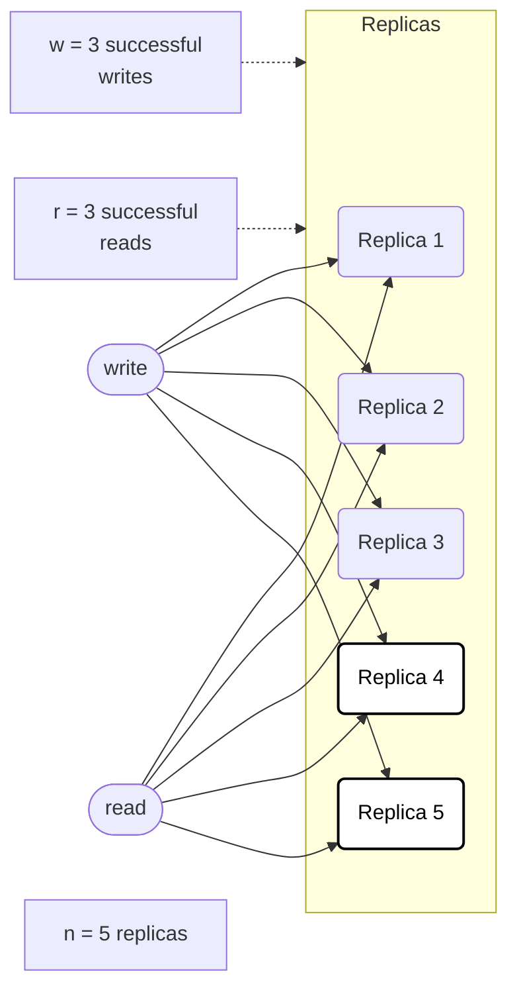
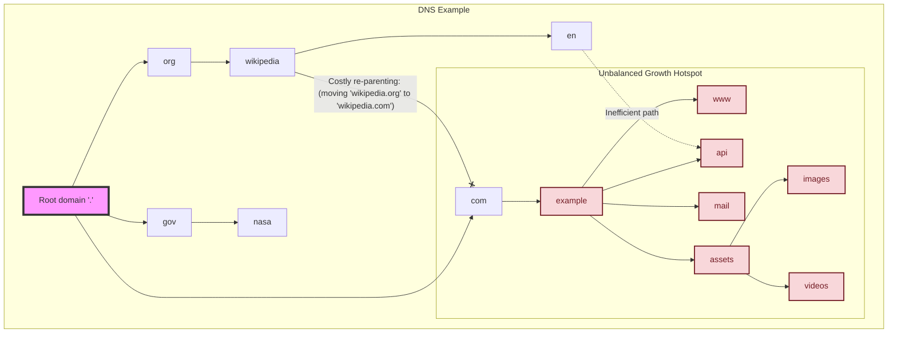
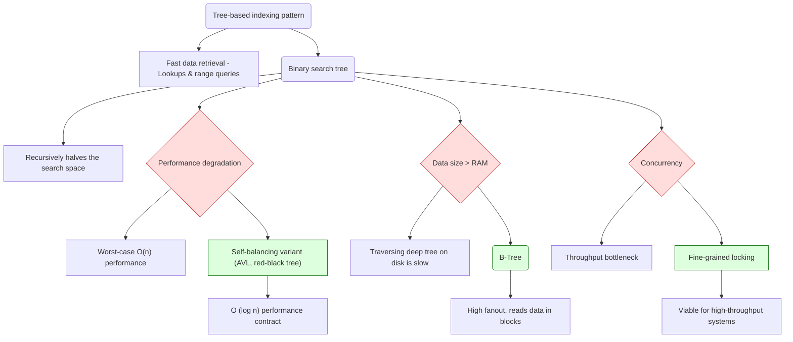
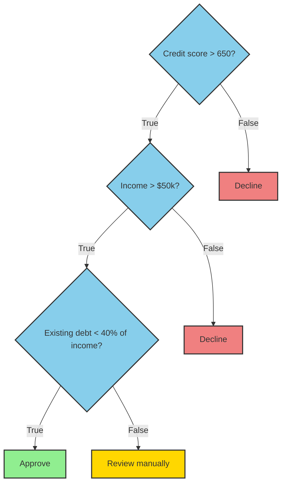
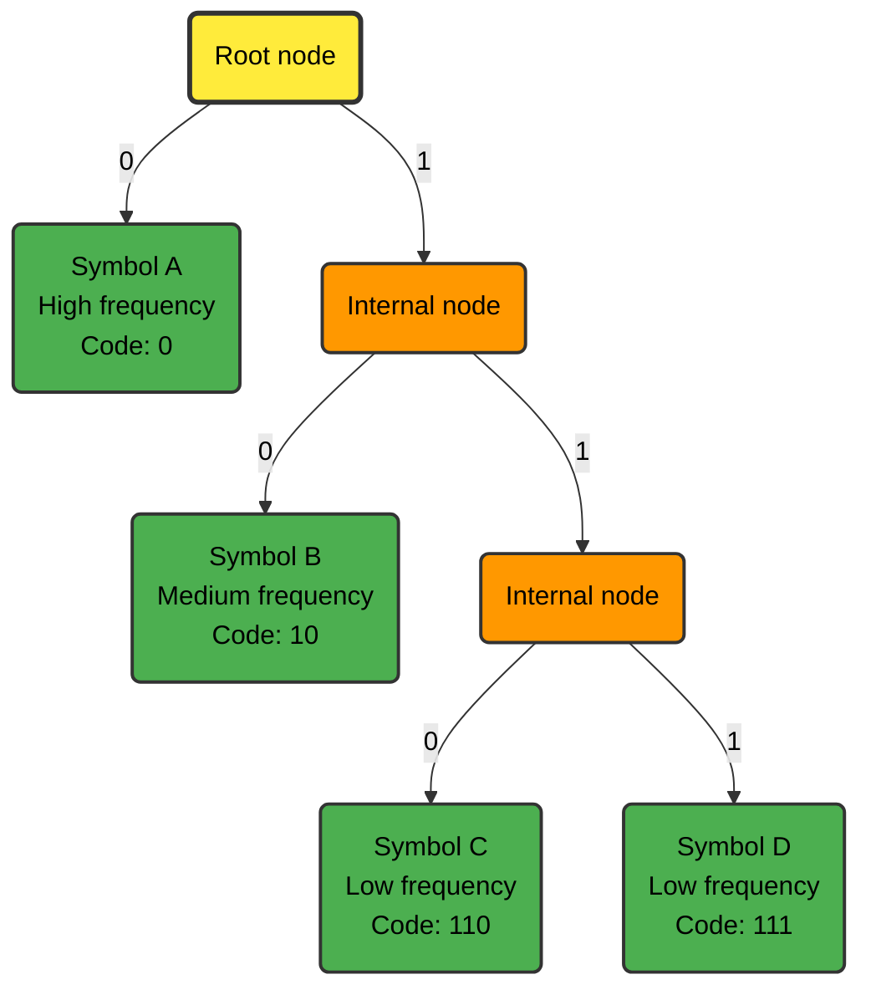

# System Design

## Table of Contents

- [Feature Sets](#feature-sets)
- [Interfaces](#interfaces)
- [Class Hierarchies](#class-hierarchies)
- [Distributed Systems](#distributed-systems)
- [Designing a System under Certain Constraints](#designing-a-system-under-certain-constraints)
- [Simplicity](#simplicity)
- [Limitations](#limitations)
- [Robustness](#robustness)
- [Tradeoffs](#tradeoffs)
- [How the Internet Works](#how-the-internet-works)
    - [Routers](#routers)
    - [Domain Name Servers](#domain-name-servers)
    - [Load Balancers](#load-balancers)
    - [Firewalls](#firewalls)
- [Traversing a Graph](#traversing-a-graph)
- [Run-time Complexity of Graphs](#run-time-complexity-of-graphs)
- [A Distributed Hash Table System](#a-distributed-hash-table-system)
- [Resource Estimation with Real Systems](#resource-estimation-with-real-systems)
- [The Big Product Design Picture](#the-big-product-design-picture)
- [Translation of an Abstract Problem to a System](#translation-of-an-abstract-problem-to-a-system)
- [API Discussions](#api-discussions)
- [Binary Trees](#binary-trees)
- [Cache](#cache)
- [MapReduce](#mapreduce)
- [For Loop Problems](#for-loop-problems)
- [Index](#index)
- [Reverse Linked List](#reverse-linked-list)
- [Compilers](#compilers)
- [Memory Cache](#memory-cache)
- [Networks](#networks)

## Feature Sets

## Interfaces

## Class Hierarchies

## Distributed Systems

## Designing a System under Certain Constraints

Let's start with a summary of what eventual consistency is and what its limitations are. Eventually consistent systems in the style of Amazon Dynamo are designed to be fast and highly available during failures, even when parts of the system fail. We're guaranteed that all copies of data will converge to the same state at some future point. However, this puts the burden of handling temporary inconsistencies on the application. Here are some examples of guarantees that eventual consistency can't provide:

- *Key uniqueness*: If we can't guarantee uniqueness of email addresses registered with accounts, one email address may get attached to two accounts.
- If **check-and-set** is done by reading and then writing, the order of updates between competing writers may not be the same on all storage nodes. This means that there will be a temporary disagreement.
- *All-or-nothing updates*: If there's a network partition and the coordinator's write request only succeeds on one out of three storage nodes, the client will receive a response indicating partial success.
- *Read-your-write consistency*: The writes succeed in the zone that accepts the write. Readers in other zones aren't guaranteed to see the writes.

We're given these limitations of eventual consistency. How can we design a system that does enforce uniqueness constraints and maintain high availability?

To characterize coordination avoidance, we need a system model. We're aiming for a system with these key properties:

- *Global validity*: Invariants hold over committed states.
- *Transactional availability*: We guarantee a response.
- All copies of data in a distributed database will **converge** to the same state at some future point in the absence of any changes.
- *Coordination-freedom*: Transactions shouldn't have to communicate during transaction execution

We're trying to build a system where data is replicated across many servers, transactions can happen on any server without talking to others, and yet we can guarantee that our data remains consistent and that all servers eventually agree.

Our **database** as a collection of data items[^dscc01]. Each has multiple versions. Application clients submit requests to the database in the form of transactions, or groups of operations[^dscc02] that should be executed together. Each transaction operates on a logical **replica**, or set of versions of the items mentioned in the transaction. Transactions operate over "snapshots” of database state. Upon commit[^dscc03], the replica state is **merged** into the set of versions on at least one server. We assume this merge operator is commutative, associative, and idempotent. For example, if server

$R_x = \{v\}$

and

$R_y = \{w\}$

then

$R_x \sqcup R_y = \{v, w\}$

To determine whether a database state is valid according to application correctness criteria, we use **invariants**. You need usernames to be unique. Other kinds of constraints are very similar: An account balance never goes negative, a meeting room doesn't have overlapping bookings. A transaction can commit, or abort[^dscc04] if committing the transaction would violate a declared invariant over the replica state of its set of transactions $T$. A transaction can only abort if it explicitly chooses to abort itself or if committing would violate invariants over the transaction's replica state. A system is convergent iff, in the absence of new writes, the servers eventually contain the same version for any item they both store. We apply the merge operator to produce a convergent state. A system provides coordination-free execution for $T$ iff the progress of executing each $t \in T$ is only dependent on the versions of the items $t$ reads[^dscc05]. That is, in a coordination-free execution, each transaction's progress towards commit/abort is independent of other operations[^dscc06] being performed on behalf of other transactions.

If $\mathcal I$-confluence holds, there exists a correct, coordination-free execution strategy for the transactions. Two servers have independently made changes that are individually correct[^dscc07]. Can we always merge those changes and still have a correct state? A set of transactions $T$ is $\mathcal I$-confluent with respect to invariant $\mathcal I$ if, for all $\mathcal I-T$-reachable states $D_i, D_j$ with a common ancestor state, $D_i \sqcup D_j$ is $\mathcal I$-valid. Under $\mathcal I$-confluence, the states produced by these sequences[^dscc01] must be valid under merge.

*Figure DSCC-1*


*Theorem 1*: A globally $\mathcal I$-valid system can execute a set of transactions $T$ with coordination-freedom, transactional availability, convergence if and only if $T$ is $\mathcal I$-confluent with respect to $\mathcal I$.

The theorem establishes $\mathcal I$-confluence as necessary and sufficient for coordination-free execution. If $\mathcal I$-confluence holds, there exists a correct, coordination-free execution strategy for the transactions; if not, no possible implementation can guarantee these properties for the provided invariants and transactions.

$\rightarrow$ If $\mathcal If $\mathcal I$-confluence holds, each server can independently check if a transaction violates the invariant based on its local replica. There exists a coordination-free execution strategy for the transactions.

$\leftarrow$ If we have coordination-freedom, $\mathcal I$-confluence must hold. The forwards direction uses a partitioning argument to derive a contradiction. $\bot$ To prevent invalid states, at least one of the transaction sequences will have to forgo coordination-freedom.

Writes are performed in the same, well-defined order[^dscc09]. The merge procedures[^dscc10] are deterministic so that servers resolve the same conflicts in the same manner. The Bayou system uses a primary commit scheme. One server designated as the primary takes responsibility for committing updates. The primary is responsible for deciding the final order of committed operations. Truncating the logs guarantees that they can catch up with the latest state.

- *Log truncation*: As a multi-tenant database, [Manhattan](https://blog.x.com/engineering/en_us/a/2014/manhattan-our-real-time-multi-tenant-distributed-database-for-twitter-scale) needs to provide high quality of service to each customer without overwhelming the log.

*Example DSCC-1: Handling a money transfer*


- *Multi-partition requests*: Apply every request exactly once to both the payer and payee accounts.
- We can consider more complex invariants, such as **foreign key** constraints. Insertions are $\mathcal I$-confluent, while deletions are more challenging[^dscc11].

[^dscc01]: like rows in a table
[^dscc02]: reads and writes
[^dscc03]: succeeds
[^dscc04]: reject it
[^dscc05]: *t*'s replica state
[^dscc06]: writes, locking, validations
[^dscc07]: according to our invariants
[^dscc08]: *D<subscript>in</subscript>* and *D<subscript>jm</subscript>*
[^dscc09]: first tentative, then committed
[^dscc10]: and dependency checks
[^dscc11]: cascading deletes can maintain *I*-confluence

## Simplicity

> Simplicity is a prerequisite for reliability.

-- <cite>Edsger W. Dijkstra</cite>

> Simplicity is the ultimate sophistication.

-- <cite>Leonardo da Vinci</cite>

We need to build simple systems if we want to design good software. There's not enough focus on simplicity. "Simple"[^simplicity01] means "one twist." "Complex" means "multiple twists" or "braided together." In software, this refers to whether it's folded together or not. People usually interchange "simple" with "easy." "Easy"[^simplicity02] means "near" or "familiar." All that's familiar is somewhat easy. Easiness is relative.

Simple things have one role, task, objective, or concept. They may be one dimension of a problem. They don't interleave issues. Simplicity doesn't mean one of a kind. An interface could have multiple methods and still be simple. Simplicity is objective.

Symptoms of complexity:

- explosion of the state space
- tight coupling
- tangled dependencies
- inconsistent naming
- special casing

[Moseley and Marks](https://curtclifton.net/papers/MoseleyMarks06a.pdf) look at which bits of complexity are accidental and which are essential. Essential complexity is inherent in the problem itself[^simplicity03]. It's the complexity that would exist even in an ideal development environment. Accidental complexity is complexity arising from implementation choices, suboptimal language and infrastructure, and performance issues. It's the complexity that could be avoided. Software engineering's goal should be to eliminate accidental complexity as much as possible and assist with essential complexity.

Avoid state and control where they aren't absolutely essential. Separate complexity that's either truly essential, or useful from a practical point of view from the rest of the system. Separate logic from state and essential complexity from accidental complexity. These principles aren't new.[^simplicity04]

Separate out the system's pure logic.

Essential state is the foundation. Changes to the essential state may require changes in other specifications, but changes in other specifications may never require changes to the essential state specification. Changes to the essential state may require changes to the logic, but changes to accidental state and control should never affect the essential logic. Accidental state and control are the least important conceptually. Changes here should never affect the other components.

A sharp focus on true essentials and avoiding useless complexity leads to less code. Good abstractions hide complexity. However, unneeded data abstraction can increase complexity due to subjectivity in grouping data. The relational model involves minimal commitment to subjective groupings, and this commitment has only minimal impact on the rest of the system.
Abstraction is a good tool for removing complexity. Good abstractions hide implementation details and behind a simple interface. For example, high-level programming languages hide machine code, and SQL hides data structures and concurrency.

- *What?* Define abstractions[simplicity05] as sets of functions. Make them small. Use polymorphism.
- *Who?* Define the data/entities your abstractions will use. Pass subcomponents as arguments. - Don't hardwire.
- *How?* Implement the details, using polymorphism and isolating implementations.
- *When?* Where? Avoid connecting objects directly; use queues to decouple them.
- *Why?* Use declarative systems to implement policies and rules. Rules tend to increase complex control flow.

Keep information simple. Don't use objects to handle information. Use generic constructs[^simplicity06] to manipulate information. Don't tie data logic to its representation. Avoid ORM where possible.

- *Values* - Use final, persistent collections.
- *Functions* - Use stateless methods.
- *Namespaces* - Use languages with good namespace support.
- *Data* - Use maps, arrays, sets, XML, JSON, etc.
- *Polymorphism* -  Use protocols, type classes.
- *Managed references* - Use Clojure, Haskell.
- *Set functions* - Use libraries.
- *Queues* - Use libraries.
- *Declarative data manipulation* - Use SQL, LINQ, Datalog.
- *Rules* - Use libraries or Prolog.

Choose simple tools. Write simple code. Simplify existing code by disentangling it.

Avoid tools[^simplicity07] that generate complex outputs. Reliability tools[^simplicity08] are good but secondary. They don't enforce simplicity; they're just a safety net. Simplify the problem before starting to code. Use abstractions and design upfront.

Isolate and gentrify a system's disordered parts. One frequently constructs a facade to put a "pretty face" in front of the unpleasant that's swept under the rug. Intention-revealing selectors expose functionality. Consolidation hems unregulated growth that may have occurred during prototyping or expansion.

Daily builds[^simplicity09] and keeping the last working version around are nearly universal practices among successful maintenance programmers. Rigorous testing[^simplicity10] is vital for ensuring a working system. Refactoring maintains order.

Functional programming (FP) has roots in the stateless lambda calculus, equivalent in computational power to the Turing machine. Whilst object-oriented programming was developed out of a desire to manage the stateful von Neumann architecture, FP avoids state-related complexity. This has very significant benefits for testing and reasoning.

[^simplicity01]: from "sim" and "plex"
[^simplicity02]: from the Latin for "adjacent"
[^simplicity03]: as seen by the users
[^simplicity04]: [Kowalski's "Algorithm = Logic + Control"](https://www.doc.ic.ac.uk/~rak/papers/algorithm%20=%20logic%20+%20control.pdf) is a classic example.
[^simplicity05]: interfaces, protocols
[^simplicity06]: maps, etc.
[^simplicity07]: constructs
[^simplicity08]: testing, refactoring
[^simplicity09]: Microsoft, Nortel
[^simplicity10]: extreme programming's unit tests

## Limitations

It's **important to monitor** whether your databases are returning up-to-date results even if an application can tolerate stale reads. Your replication should alert you so that you can investigate the cause[^limitations1] if it falls behind. You can measure replication lag by subtracting a follower's position from the leader's. Monitoring is more difficult in leaderless replication because there's no fixed order in which writes are applied. There has been some research on measuring staleness depending on `n`, `w`, and `r`, but it's not yet a common practice. Eventual consistency is a vague guarantee. For operability, it's important to **quantify "eventual."**

*Figure L-1*



Dynamo-style databases are optimized for eventual consistency. The parameters `w` and `r` allow you to adjust the probability of stale values being read, but it's wise to not take them as absolute guarantees. Stronger guarantees^[limitations2] generally require transactions or consensus.The set of nodes to which you've written and the set of nodes from which you've read must overlap. It's not clear which write happened "before" another without a mechanism to determine the order of **concurrent writes**[^limitations3]. If the "last write wins," writes can be lost due to clock skew. In this case, it's undetermined whether the read returns the old or the new value. It could break the quorum condition. Even if everything is working correctly, there are edge cases in which you can get unlucky with the timing.

Riak is based on Dynamo. Riak intends to add support for **strict quorums** with PW/PR turns out to have a corner case where the guarantees aren't enforced. Riak optimizes for **"always writable" over "read-your-own-writes"** consistency. A **write failure** in Riak doesn't mean the value won't later show-up in a read. You may eventually read it through read repair.
WARS models only a **single write and read**. It's a conservative estimate for multi-write scenarios.

WARS (write-after-read staleness) treats each distribution as **independent and identically distributed**.

WARS **doesn't capture effects of common anti-entropy processes** (e.g., read-repair[^limitations4], Merkle-tree exchange[^limitations5]). WARS doesn't address system behavior under **failures**[^limitations6], which varies. It **assumes that clients contact a coordinator** server instead of issuing requests themselves. There are plenty of append-only data stores[^limitations7]. They all suffer from compaction-related performance issues.

**Clients requiring staleness detection may do so asynchronously**, enabling speculative reads and compensatory actions.

**The data structures you query** are used in Datomic and, to some extent, CouchDB. Compaction and garbage collection become crucial. Old versions must eventually be cleaned up. RethinkDB's "young blocks" subsystem[^limitations8] mitigates this. The LSM tree approach offers high write throughput. There are no silver bullets. Achieving good performance requires an enormous amount of tuning work to get everything right. Getting purge/compaction right is a hard engineering problem. Immutability needs additional disk space.

Truly deleting data is surprisingly hard, since copies can live in many places, and backups are often deliberately immutable. You sometimes have to try. Data protection legislation may require erroneous information to be removed. **Humans** need a "snapshot," rather than noisy real-time data changes.

XA transactions introduce operational problems. If the transaction coordinator isn't replicated, it's a **single point of failure** for the entire system. Many coordinator implementations aren't highly available by default or only have rudimentary replication support. The coordinator's logs become a crucial part of the durable system state - as important as the databases themselves. Such application servers are no longer stateless. XA is necessarily the **lowest common denominator**. For example, it can't detect deadlocks across different systems, and it doesn't work with serializable snapshot isolation. The tendency to **amplify failures** runs counter to building fault-tolerant systems. There are alternative methods that allow us to achieve consistency across systems without the pain of heterogeneous distributed transactions.

[^limitations1]: network issues, overloaded nodes
[^limitations2]: such as read-your-writes, monotonic reads, or consistent prefix reads
[^limitations3]: like vector clocks or a globally consistent timestamp, which introduces its own challenges
[^limitations4]: inconsistencies are corrected during reads
[^limitations5]: used for efficient data synchronization
[^limitations6]: node failures, network partitions
[^limitations7]: LSM trees, CouchDB, Datomic
[^limitations8]: which prioritizes reently-updated blocks

## Robustness

## Tradeoffs

## How the Internet Works

### Routers

### Domain Name Servers

### Load Balancers

### Firewalls

## Traversing a Graph

The use of the same data value as a primary key and a secondary key is a basic concept. This reflects real-world relationships and re-establishes those relationships for processing. A programmer can:

1. start at the beginning or a known record and access records sequentially.
1. use a database key for direct access to a record's physical location.
1. use a primary data key.
1. use a secondary data key to access all records with that value.
1. traverse from a set's owner to its member records.
1. traverse between members of a set.
1. start from any member and access the owner of the set.

Data structure sets are declared and maintained. They contribute to programmers the capability to:

* associate records into sets.
* use these sets as retrieval paths.

```sql
CREATE TABLE vertices (
    vertex_id integer PRIMARY KEY,
    properties json);
CREATE TABLE edges (
    edge_id integer PRIMARY KEY,
    tail_vertex integer REFERENCES vertices (vertex_id),
    head_vertex integer REFERENCES vertices (vertex_id),
    label text,
    properties json);
CREATE INDEX edges_tails ON edges (tail_vertex);
CREATE INDEX edges_heads ON edges (head_vertex);

```

*Example TG-1*

For any vertex, you can retrieve both incoming and outgoing edges, thus traversing the graph forward and backward. That's why Example TG-1 has indexes on `tail_vertex` and `head_vertex`.

The directions of 'in' and 'out' were reversed. Where the input notion of the sequential file world meant 'into the computer from tape,' the new input notion became 'into the database.' This revolution in thinking changes the programmer from a stationary observer to a navigator traversing the database. Processing a single transaction involves a path through the database. A record would be used to gain access to other records. Each of these records is used in turn as a point for examining other sets. The [Neo4j Traversal API](https://neo4j.com/docs/) is a callback-based, lazily executed way for specifying these movements in Java. [Some traversal examples are collected.](https://neo4j.com/docs/2.0.0/tutorials-java-embedded-traversal.html) We want to train programmers to navigate in an *n*-dimensional data space. Neo4j's graph algorithms component contains implementations of common graph algorithms like:

- shortest paths
- all paths
- all simple paths
- Dijkstra's
- A*

This 'traverser' concept is new in TinkerPop3, providing the means by which steps remain stateless. A traverser maintains all the metadata about the traversal – how many times the traverser has gone through a loop, path history, the current object, etc. Path calculation is costly in terms of space. The traverser stores an array of previously visited objects. Thus, a traversal strategy analyzes whether path metadata is required. If not, path calculations are turned off. Never rely on the iteration order in TinkerPop3 traversals. Even within a release, traversal optimizations may alter the flow.

[Cypher](https://neo4j.com/docs/2.0.0/cypher-query-lang.html), a powerful declarative query language, queries the graph. [TinkerPop3's `GraphTraversal` JavaDoc](https://tinkerpop.apache.org/javadocs/3.4.6/core/org/apache/tinkerpop/gremlin/process/traversal/dsl/graph/GraphTraversal.html) lists all steps and their descriptions. The [Gremlin Console](https://tinkerpop.apache.org/docs/3.2.3/reference/#gremlin-console) can be used for these steps.

```groovy
gremlin> g.V // (1)
  ==>v[1]
  ==>v[2]
  ==>v[3]
  ==>v[4]
  ==>v[5]
  ==>v[6]

gremlin> g.V.name // (2)
  ==>marko
  ==>vadas
  ==>lop
  ==>josh
  ==>ripple
  ==>peter

gremlin> g.V.outE.weight // (3)
  ==>0.4
  ==>0.4
  ==>0.5
  ==>1.0
  ==>1.0
  ==>0.2

```

1. `g.V` retrieves all vertices. There's no need for parentheses.
1. `g.V.name` is interpreted as `g.V().values('name')`.
1. A chain of zero-argument step calls is followed by a property value call.

Domain-specific language authors should leverage the steps, as then the common optimization and decoration strategies can reason on the underlying traversal sequence. If new steps are introduced, these optimizations may not function properly.

Physics yields minimum-energy solutions; a similar science must be developed for database access. This includes the traversal of existing databases, building databases, and restructuring them to best fit the changing access patterns.

## Run-time Complexity of Graphs

When we characterize the running time of a graph algorithm on a given graph $G = (V, E)$, we usually measure the size of the input in terms of the number of vertices $\vert V \vert$ and the number of edges $\vert E \vert$ of the graph. That is, we describe the size of the input with two parameters, not just one. We adopt a common notational convention for these parameters. Inside asymptotic notation[^rcg1] and only inside such notation, the symbol $V$ denotes $\vert V \vert$ and the symbol $E$ denotes $\vert E \vert$. For example, we might say, "the algorithm runs in time $O(VE)$," meaning that the algorithm runs in time $O(\vert V \vert \vert E \vert)$. This convention makes the running-time formulas easier to read without risk of ambiguity.

[^rcg1]: such as *O*-notation or *Θ*-notation

## A Distributed Hash Table System

## Resource Estimation with Real Systems

## The Big Product Design Picture

## Translation of an Abstract Problem to a System

## API Discussions

Most applications are built by layering one data model on top of another. For each layer, the key question is: how is it *represented* in terms of the next-lower layer?

When you combine several tools to provide a service, the service's API becomes the critical abstraction layer that hides implementation complexity from clients. This API design choice propels you from a simple application developer into a data system architect. Your composite system now bears responsibility for certain guarantees like cache consistency on writes, ensuring reliable data access patterns, and presenting a coherent interface despite the underlying complexity.

The process of building data systems involves multiple levels of representation, each serving a purpose:

- As a developer, you observe the real world - people, organizations, transactions, sensor readings, business processes - and translate these autonomous entities into objects, data structures, and APIs. These abstractions are inherently domain-specific, capturing the constraints of your use case.
- When persisting these application-specific structures, you must express them using general-purpose data models. Whether you choose JSON documents, XML structures, relational tables, or graph representations depends on your query needs.
- Database engineers have solved the problem of representing logical data models as bytes in memory, on disk, and across networks. This representation deploys querying, indexing, searching, and manipulation capabilities that deliver performance while handling concerns around durability and concurrency.
- At the foundation, **hardware** engineers have devised methods for representing bytes as electrical currents, optical pulses, magnetic fields, and quantum states - each with different cost profiles and operational characteristics that morph the fundamental nature of computation itself.

Designing APIs for data systems requires architects to navigate the dissonance between simplicity and functionality, ensuring that esoteric implementation details remain hidden behind intuitive interfaces. How do you guarantee data integrity when internal components fail? Your API must retain a consistent view of the data even when underlying systems experience temporary unavailability. Clients expect reliable **performance**, but real systems experience resource constraints. API design demands prescient strategies for graceful **degradation**, load shedding, and maintaining acceptable response times during adverse conditions. Your API design decisions compound as usage grows. Early choices about interface granularity impact your ability to **scale** horizontally and handle increased load. What constitutes a "good" API? The **interface** should be intuitive for developers while providing sufficient flexibility for diverse use cases. Consider implementing apposite patterns for discoverability, versioning, and backward compatibility.

Applications fabricate multiple intermediary levels - APIs built upon APIs, each adding specialized functionality or adapting between different domains. Despite this complexity, the principle remains constant: each layer provides a clean abstraction that hides lower-level complexity. These abstraction boundaries enhance collaboration between different teams. Database vendors can concentrate on storage efficiency and query optimization while application developers concentrate on business logic. The API serves as the contract between these groups, allowing them to work independently yet build cohesive systems. This layered approach also proves flexible for evolution. You can replace or upgrade components at one layer without affecting others, as long as the API contract remains stable. This modularity becomes inevitable as systems grow and requirements change over time.

## Binary Trees

The binary tree is a computational model for **recursive decomposition**. It represents a powerful pattern for solving problems by repeatedly splitting them into two self-similar sub-problems. I analyze the application of the binary tree pattern in system architecture. I'll demonstrate how this model is used to design systems for hierarchical data management, examining each application's architectural trade-offs.

The binary tree pattern is applicable when a problem space can be recursively divided by a binary choice. A complex domain needs to be represented. A binary question is asked[^bt01] at each step. The answer determines which of the two sub-problems to pursue next. This process naturally evolves a binary tree, where each internal node explicates a decision point[^bt02] and the leaves represent the atomic outcomes. The architecture inherent to all tree-based designs is **managing the tree's balance**. An unbalanced tree can negate performance benefits and introduce systemic risks.

*Example BT-1*



The Domain Name System (DNS) Example (Example BT-1) is the most direct application, used for data that has an intrinsic parent-child relationship. Modeling file systems, organizational charts, UI component trees[^bt03], and geographic namespaces. Nodes maintain objects or containers, and child pointers define the hierarchy. The DNS is a canonical example, where the root domain is the tree's root, and each subdomain[^bt04] represents a path down the tree - an intuitive model for hierarchical data. Traversal paths[^bt05] map directly to tree traversal. Navigating between distant nodes[^bt06] is inefficient. Re-parenting large subtrees is a costly operation. Unbalanced growth[^bt07] creates pernicious performance hotspots.

*Example BT-2*



The tree-based indexing pattern (Example BT-2) uses a binary tree to build efficient indexes for fast data retrieval. Index a dynamic dataset within a database, search engine, or other stateful service to accelerate rapid lookups and query ranges. The search space is partitioned at each node instead of a linear scan. The classic implementation is a **Binary Search Tree** (BST). The decision at each node[^bt08] recursively halves the search space. A naive BST offers no **performance guarantee**. A system design **must** specify a **self-balancing variant**[^bt09] to enforce an $O(\log n)$ performance contract and prevent worst-case $O(n)$ degradation from non-random data patterns[^bt10]. This pattern is ideal for in-memory indexes. The I/O cost of traversing a deep binary tree is prohibitive for datasets larger than RAM. The pattern must then be evolved into a **B-tree**, which has a high fanout and is optimized for block-based disk reads. A simple tree index is a single point of contention. High-throughput systems require sophisticated lock-free structures to be viable.

*Example BT-3*



The **decision tree** (Example BT-3) uses a binary tree to encode a sequence of decisions. Implement machine learning classifiers. It is constructed. Each internal node constitutes a conditional test[^bt11], and its two children select the subsequent action or determine the next test for the true-and-false outcomes. The leaves constitute the final classification. Decision trees are highly transparent[^bt12], which is a major advantage for debugging business logic or complying with regulations. Complex decision trees prove brittle and difficult to update. A small change in an early rule can have cascading, unintended consequences. Traversal is very fast[^bt13], making it suitable for real-time decision-making applications like telephony and packet filtering.

Example BT-4*



**Huffman coding** (Example BT-4) uses a binary tree's structure to institute a variable-length prefix code for data compression. Compress data for storage or network transmission. Huffman coding builds a binary tree based on the frequency of symbols in the input data. Frequent symbols are placed closer to the root, resulting in shorter bit codes. The path from the root to a symbol's leaf node[^bt14] defines its unique binary code. Highly effective for data with a skewed frequency distribution. It's a component in widely used compression standards like *gzip* and DEFLATE. The frequency table, or a smattering of metadata about the tree itself, must be transmitted along with the compressed data so the decompressor can rebuild the exact same tree. This adds a fixed **overhead** that proves counterproductive for very small payloads. It's a two-pass algorithm[^bt15], which isn't suitable for pure streaming applications without adaptive variants.

Naive **recursive** implementations are elegant but risk **stack overflow** if the tree becomes unexpectedly **deep**. Production systems should favor iterative solutions over recursive ones when tail-call optimization is unavailable. A shared tree structure is a bottleneck. The design must specify a **concurrency** control model:

- *Coarse-grained Locking*: Simple but kills performance.
- *Fine-grained Locking*: High performance but notoriously difficult to implement correctly[^bt16].
- *Lock-free Algorithms*: The best performance, but requires expert-level knowledge.

It's better to use a pre-existing concurrent library implementation than to build one for most systems. A **serialization** format is needed to save a tree's state. A **preorder traversal** is used because it perfectly reconstructs the original tree's structure, which is critical for specific layouts.

[^bt01]: "Is the value less than or greater than the pivot?", "Does the item belong to the left or right half of the space?", "Is the condition true or false?"
[^bt02]: a partition
[^bt03]: DOM, React Virtual DOM
[^bt04]: [wikipedia.org](https://www.wikipedia.org/), [en.wikipedia.org](https://en.wikipedia.org/)
[^bt05]: `/home/user/file.txt`
[^bt06]: cousins
[^bt07]: one directory with millions of files
[^bt08]: `key < node.key`
[^bt09]: red-black tree, AVL tree
[^bt10]: a major operational risk
[^bt11]: "Is `packet.port == 445`?"
[^bt12]: "white box"
[^bt13]: *O*(log n)
[^bt14]: `left = 0`, `right = 1`
[^bt15]: first pass to calculate frequencies, second to encode
[^bt16]: risk of deadlocks

## Cache

I discuss caching in database performance in optimizations to the [Shore database system](https://research.cs.wisc.edu/shore/) and their benefits of cache-conscious data structures.

I clarify a common misconception about in-memory databases. Counterintuitively, the performance advantage of in-memory databases isn't due to the fact that they don't need to read from disk. Modern operating systems cache recently used disk blocks in memory. Therefore, even a disk-based storage engine may never need to read from disk if you have enough memory if sufficient RAM is available. They can be faster because they can avoid the overheads of encoding in-memory data structures in a form that can be written to disk.

Optimizations to Shore reduced overhead in areas like concurrency control and recovery[^cache1]. Optimizations remove 80-88% of the time spent in B-tree operations without changing the key access pattern. Switching from a stripped-down Shore to a minimal-overhead kernel removes three-quarters of the remaining time. Optimizing components other than data structures themselves[^cache2] has a more substantial initial impact on performance than solely cache-optimized data structures.

"Cache-conscious" data structures minimize cache misses. A cache miss occurs when the CPU needs data that isn't currently in the fast cache memory[^cache3], forcing it to retrieve the data from slower main memory[^cache4] or, even worse, from disk. While efficient for disk-based systems, traditional B-trees aren't inherently cache-conscious. They can lead to cache misses as the CPU traverses the tree, accessing nodes not contiguous in memory. Cache-conscious research on B-trees improves data locality and targets cache misses. This rearranges the B-tree node layout in memory to increase the likelihood that related nodes are stored close together, improving the chances that they'll be loaded into the cache together.

While initial optimizations focused on higher-level system components, once a system is stripped down to a very basic kernel, cache misses in the B-tree code may well be the new bottleneck. At this point, it may be the case that other indexing structures, such as hash tables, perform better in this new environment. For example, hash tables offer better performance characteristics in a highly optimized, in-memory environment. However, these conjectures should be carefully tested.

[^cache1]: ensuring consistency after failures
[^cache2]: concurrency control, recovery
[^cache3]: L1, L2, L3 caches
[^cache4]: RAM

## MapReduce

### The Programming Model

MapReduce is a programming model and associated implementation designed for processing and generating large datasets that may not fit in the memory of a single machine. It simplifies distributed data processing by handling the complexities of parallelization, data distribution, fault tolerance, and load balancing. It allows programmers to utilize resources on large clusters of commodity machines without any experience in distributed systems. Users specify two functions, `map` and `reduce`.

A computation takes a set of input key-value pairs and produces a set of output key-value pairs. The user expresses the computation as two functions:

- **`map`**, written by the user, takes an input pair and produces intermediate key-value pairs. Think of this as transforming and extracting relevant data from each input record.
- The **`reduce`** function merges together all intermediate values associated with the same intermediate key, typically aggregating, summarizing, or filtering them, to produce zero one output values.

Programs written in this functional style are automatically parallelized and are fault-tolerant. Many real-world tasks, such as counting word occurrences in a large document collection, building inverted indexes, or analyzing web server logs, are expressible in this model. Although MapReduce's importance is declining, it provides a clear picture of why and how batch processing is useful. It was a major step forward in terms of the scale of processing that could be achieved on commodity hardware.

### Example: Word Count

```c++
map(String docName, String docContent):
  for each word w in docContent:
    EmitIntermediate(w, "1");

reduce(String word, Iterator values):
  int result = 0;
  for each v in values:
    result += ParseInt(v);
  Emit(AsString(result));

```

The `map` function emits each word plus a count of `1` in this example. The `reduce` function sums together all counts emitted for a particular word.

### Types

Even though the previous pseudocode is written in terms of string inputs and outputs, the `map` and `reduce` functions have associated types:

- `map (k1, v1) -> list(k2, v2)`
- `reduce (k2, list(v2)) -> list(v2)`

That is, the input keys and values `(k1, v1)` are drawn from a different domain than the output keys and values. The intermediate keys and values `(k2, v2)` are from the same domain as the output keys and values. The C++ implementation leaves it to the user code to convert between string and appropriate types.

### More Examples

* *Distributed Grep:* `map` emits a line if it matches a pattern; `reduce` is the identity function[^mr01].
* *Count of URL Access Frequency:* `map` outputs `<URL, 1>`; `reduce` adds the values for the same URL.
* *Reverse Web-Link Graph:* `map` outputs `<target, source>` for each link; `reduce` concatenates the list of source URLs associated with a target.
* *Term-Vector per Host:* `map` emits `<hostname, term_vector>`; `reduce` adds the term vectors together for a given host.
* *Inverted Index:* map emits `<word, documentID>`; `reduce` sorts corresponding document IDs and emits `<word, list(documentID)>`.
* *Distributed Sort:* `map` emits `<key, record>`; `reduce` emits all pairs unchanged[^mr02].

### Implementation and Execution

An implementation of MapReduce is targeted to large clusters of commodity PCs connected via switched Ethernet. in the environment:

1. Machines are typically dual-processor x86 machines with 2-4 GB of RAM running Linux.
1. Commodity hardware[^mr03] is used, averaging less overall bisection bandwidth.
1. A cluster contains hundreds or thousands of machines, and therefore failures are common.
1. Storage is provided by inexpensive IDE disks directly attached to machines, managed by a distributed file system that uses replication for fault tolerance.
1. Users submit jobs to a scheduling system that maps tasks to available machines.

### Execution Overview


*Figure MR-1*

The execution of a MapReduce operation proceeds as follows[^mr04]:

1. The input data[^mr05] is split into *M*[^mr06] independent chunks. This allows for parallel processing. It then starts multiple copies of the program on the cluster. One copy is the master, which assigns tasks to worker processes.
2. The library creates *M* `map` tasks and *R* `reduce` tasks. These tasks are assigned to worker machines in a cluster. A worker assigned a `map` task reads the corresponding input split, parses key-value pairs, and calls the user-defined `map` function for each pair. Intermediate key-value pairs are buffered in memory.
3. The master assigns idle workers either a `map` or a `reduce` task.
4. Periodically, buffered pairs are written to the worker's local disk, partitioned into *R* regions[^mr07]. The locations of these files are sent to the master.
5. When a `reduce` worker is notified by the master about the locations of intermediate files, it uses remote procedure calls to read the data from the `map` workers' local disks. After reading all its intermediate data, the `reduce` worker sorts it by the intermediate keys. If the data is too large for memory, an external sort is used.
6. Each `reduce` task receives an intermediate key and an iterator over the set of values associated with that key. The `reduce` worker iterates over the sorted intermediate data. The iterator allows processing of value lists that are too large to fit in memory. The user-defined `reduce` function is applied to produce the final output. For each unique key, it passes the key and the corresponding set of values to the user's `reduce` function. The output of the `reduce` function is appended to a final output file for that `reduce` partition. When all `map` and `reduce` tasks are complete, the master wakes up the user program. The output is available in *R* output files[^mr08]. These files are often used as input to another MapReduce job or another distributed application.

### Master Data Structures

The master keeps data structures to store the state[^mr09] and worker identity for each `map` and `reduce` task. It stores the locations and sizes of the *R* intermediate file regions produced by the completed `map` task. The information is pushed to in-progress `reduce` tasks.

### Fault Tolerance

MapReduce is designed to tolerate machine failures gracefully.

* The master pings workers periodically. If *a worker fails*, any completed `map` tasks are reset to idle and rescheduled. In-progress `map` and `reduce` tasks on the failed worker are also reset. Completed `map` tasks are re-executed because their output is on the failed machine's local disk. Completed `reduce` tasks don't need re-execution since their output is in the global file system.
* The master writes periodic checkpoints. *Master failure* is unlikely[^mr10]; therefore an implementation would abort the computation. Clients can retry the operation.
* *Semantics in the Presence of Failures:* When `map` and `reduce` operators are deterministic, the output is the same as a non-faulting sequential execution. This is achieved by relying on atomic commits of task outputs. Each task writes to private temporary files. When a task completes, the worker sends a message to the master. When a `reduce` task completes, the worker atomically renames its temporary file. When operators are non-deterministic, weaker but reasonable semantics are provided.
* Network bandwidth is a scarce resource. MapReduce conserves bandwidth by taking advantage of the fact that input data is stored on the *local* disks of the machines. The master attempts to schedule `map` tasks on machines containing a replica of the input data, or failing that, near a replica.
* *Task Granularity:* The `map` phase is divided into *M* pieces, and the `reduce` phase into *R* pieces. Ideally, *M* and *R* should be much larger than the number of worker machines to improve load balancing and speed up recovery. There are practical bounds on *M* and *R* since the master must make $O(M + R)$ decisions and keeps $O(MR)$ state in memory.
* *Backup Tasks:* To alleviate the problem of "stragglers"[^mr11], the master schedules backup executions of remaining in-progress tasks close to completion. The task is marked as completed when either the primary or backup execution completes.

### Refinements and Extensions

Although the basic MapReduce functionality is powerful, a few extensions are useful.

* Users specify the number of `reduce` tasks (*R*) and, optionally, a special *partitioning function.* The default is `hash(key) mod R`, but custom functions are useful in some cases[^mr12].
* *Ordering Guarantees:* Within a partition, intermediate key-value pairs are processed in increasing key order. This makes it easy to generate sorted output and supports efficient lookups.
* For cases with significant repetition in intermediate keys and a commutative and associative `reduce` function[^mr13], a *combiner function* can do partial merging before data is sent over the network. This significantly reduces network traffic. The combiner function is typically the same code as the `reduce` function, but its output is written to an intermediate file.
* Users can add support for a new *input type* by providing an implementation of a simple reader interface.
* Users of MapReduce have found it convenient to produce auxiliary files as additional outputs. The application writer to make such *side-effects* atomic and idempotent.
* *Skipping Bad Records:* In an optional mode, the MapReduce library detects and skips records that cause deterministic crashes. This deals with bugs. Also, sometimes it's acceptable to ignore a few records.
* *Local Execution:* To help facilitate debugging and testing, an alternative implementation sequentially executes a MapReduce operation on a local machine.
* *Status Information:* The master runs an internal HTTP server and exports status pages showing bytes of output, processing rates, etc. They also link to standard error/output files.
* A *counter* facility counts occurrences of events[^mr14]. Counter values are propagated to the master and displayed on the status page. The master eliminates the effects of duplicate executions to avoid double-counting.

###  Usage and Lessons Learned

MapReduce has been used across a wide range of domains, including:

- large-scale machine learning
- clustering problems
- data extraction for reports
- large-scale graph computations

MapReduce's success is attributed to its ease of use, its applicability to a large variety of problems, and its scalable implementation. Restricting the programming model makes it easy to parallelize and to make computations fault-tolerant. Network bandwidth is a scarce resource. Locality optimizations allow us to read data from local disks, and writing a single copy of the intermediate data to local disk saves network bandwidth. Redundant execution can reduce the impact of slow machines and handle failures.

---


The input is typically a directory in Hadoop Distributed File System. The mapper is run for each input file. The output consists of key-value pairs. Key-value pairs are partitioned by `reducer`[^mr15], sorted, and copied from mappers to reducers, then to the distributed file system. It's common for MapReduce jobs to be chained together into workflows, such that the output of one job becomes the input to the next. Hadoop doesn't have workflow support; chaining is done implicitly by directory name. MapReduce jobs are less like Unix pipelines. Unix pipelines use small in-memory buffers.

[^mr01]: simply passes the input through
[^mr02]: relying on MapReduce's partitioning and ordering
[^mr03]: 100 Mbits/s or 1Gbit/s at the machine level is used
[^mr04]: referring to the numbered steps in Figure MR-1
[^mr05]: often stored in file
[^mr06]: typically 16-64 MB each
[^mr07]: determined by a partitioning function, often `hash(key) mod R`
[^mr08]: once per reduce task
[^mr09]: idle, in-progress, completed
[^mr10]: due to there being only one master
[^mr11]: slow tasks
[^mr12]: ensuring all URLs from the same host go to the same reducer
[^mr13]: like word count
[^mr14]: total words processed
[^mr15]: using a hash of the key

## For Loop Problems

## Index

## Reverse Linked List

## Compilers

## Memory Cache

30 years of Moore's Law has antiquated the traditional disk-oriented DBMS buffer pool architecture. It's now feasible to store entire OLTP databases directly in RAM with main memory capacity growing from megabytes to hundreds of gigabytes - and soon terabytes - on commodity servers. The overwhelming majority of OLTP databases are less than 1 Tb in size and growing in size quite slowly. As such, I believe that OLTP should be considered a main-memory market. A new engine such as H-Store can achieve dramatically better performance. I'll broach two influential systems, H-Store and RAMCloud, examining their deft approaches to durability.

### In-Memory Databases

An in-memory database stores its primary data entirely in main memory, using non-volatile storage for recovery rather than for runtime data access, achieving consummate performance gains by eliminating disk I/O latency from the query path.

Memcached is used purely as a volatile cache, but most in-memory databases embrace durability. Common strategies encompass

- *append-only logs*: writing a log of all changes to disk. The database can reload its state by replaying this log upon restart.
- **periodically** writing the entire in-memory state to disk.
- **replicating** the in-memory state to other machines so data survives a single-node failure
- *specialized hardware*: using battery-backed RAM ensures memory contents survive a power failure.

It's common to place an application-managed caching layer[^mc1] in front of a database. It is normally the application code's responsibility to keep the cache in sync with the main database in this model.

---

H-Store is a research database system designed from the ground up for high-throughput OLTP workloads. It operates on a shared-nothing cluster of nodes and is built on the principle that OLTP transactions are short-lived and are executed serially on a single CPU core to eliminate concurrency overhead.

Data is partitioned across a grid of computers. Each node is independent and manages its own data. Each CPU core on a node is treated as an independent, **single-threaded execution** site. This design eliminates unnecessary latching, creating a simpler codebase. H-Store assumes that applications interact with the database via pre-defined **stored procedures**. This minimizes network round-trips and allows for transaction analysis and optimization at definition time.

Many datasets fit in memory, but H-Store requires a  solution for cases where the database exceeds available RAM. This architecture is called **anti-caching**, as it's the inverse of a buffer pool. Anti-caching spills cold data from memory to disk instead of pulling hot data from disk into memory. A data tuple resides exclusively in one location in this model: either in main memory or on disk. It's never copied between the two. The DBMS monitors the amount of memory used. It "evicts” the least recently used (LRU) tuples to make space when the size of the database relative to the amount of available memory on the node exceeds some administrator-defined threshold.

#### Eviction Process

The system maintains a separate LRU chain per table that is local to a partition. H-Store executes special single-partition transactions that select tuples for eviction. When the eviction transaction executes, it creates a new block by popping tuples off the head of the target table's LRU chain. For each tuple being evicted, H-Store copies its data into the eviction block buffer. It then adds an entry into the Evicted Table and updates all indexes to point to this entry instead of the original tuple location. Each tuple in the Evicted Table includes a special evicted flag in its header that enables the DBMS to recognize when a transaction accesses evicted data. Once the block is full, it's **written to disk** in a sequential write operation. The single-threaded nature of the execution engine means that no other transactions access these changes until the special transaction finishes.

#### Retrieval Process

When a transaction attempts to access a tuple marked as evicted, the system intercepts the request. The transaction is switched into a **"pre-pass" mode**. It executes without making changes in this mode, simply to identify *all* the evicted data it needs. The transaction is **aborted**[^mc2] after the pre-pass. The system then issues an asynchronous request to **fetch** the required data blocks from disk in the background. The original transaction is **restarted** and executes to completion once the data is loaded back into the in-memory tables, this time with all its data in memory.

---

Nevertheless, maintaining the LRU ordering has a cost. Experiments show that a doubly-linked list is far more efficient than a singly-linked list for skewed workloads, as frequently accessed (hot) tuples near the tail of the list are updated quickly. The extra pointer's minor memory overhead is a worthwhile trade-off for the performance gain. The evicted block size impacts performance. Larger blocks reduce overall throughput, but they add the cost of being fetched. With a highly skewed workload, it is less common that multiple tuples from a single block will be requested together. Thus, the system is less likely to benefit from the locality of tuples on the same block.

### RAMCloud

RAMCloud is a low-latency key-value storage system. It sustains remote read/write times in the microsecond range by keeping all data in DRAM and using a log-structured partition for memory and disk management.

A RAMCloud cluster consists of master servers and backup servers. A master module manages the main memory of the server to store RAMCloud objects; it handles read and write requests from clients. A backup module uses local disk or flash memory to store backup copies of data owned by masters on other servers. The masters and backups are managed by a central coordinator that handles configuration-related issues such as cluster membership and the distribution of data among the servers. RAMCloud could use a master's memory as a log. New objects are simply appended at the end of the head segment. Each master's log is divided into 8 MB segments. Each segment is replicated to backups. This approach avoids allocation inefficiencies and unifies the information both in memory and on disk.

When an object is deleted or modified, RAMCloud does not modify the object's existing record in the log. Instead, it appends a tombstone record to the log. RAMCloud uses a log cleaner to reclaim free space that accumulates in the logs when objects are deleted or overwritten. The cleaner selects segments containing a high percentage of dead data, copies any live objects to new segments at the head of the log, and then frees the old segments. The cost of log cleaning rises rapidly as memory utilization increases. For example, the cleaner must copy 9 bytes of live data for every 1 byte of space it reclaims at 90% utilization, consuming bandwidth.

RAMCloud decouples memory cleaning from disk cleaning to manage this cost.

1. The first level of cleaning operates **only on the in-memory segments** on masters. It **compacts a segment**, copying its live data into a smaller region of memory and freeing the original storage.
1. The second level is the cleaning process that reclaims space on the backup disks. **Combined cleaning** is postponed by using segment compaction first to suppress the immediate need for garbage collection, allowing more time for objects to become obsolete, meaning segments will have lower utilization when they're finally cleaned, making the process much more efficient.

This two-level hierarchy leverages each medium's strengths: memory has plentiful bandwidth for compaction at high utilization, while disk has plentiful space to lower its effective utilization and reduce cleaning bandwidth requirements.

RAMCloud performs cleaning concurrently with normal read/write requests using multiple cleaner threads to hide its latency. This is simplified by the log-structured design. Segments are **immutable** once written, so cleaners can copy data without worrying about it being modified concurrently. All object lookups go through a central hash table. The cleaner can relocate an object and then **atomically update** the pointer in the hash table to refer to the new location. Fine-grained locking on hash table buckets is used to **manage contention** between cleaner and service threads. To prevent a cleaner from freeing a segment that a service thread is still reading, the system waits for all currently active RPCs to complete before reclaiming the segment's memory.

### Conclusion

The increasing affordability and capacity of RAM have catalyzed a paradigm shift in database architecture, moving from disk-centric models to in-memory designs optimized for low-latency workloads. **H-Store** postulates that it's possible to eliminate concurrency overheads through a stored-procedure-based model. Its **anti-caching** architecture embodies an elegant solution for managing datasets that exceed memory capacity by treating disk as a spill-over area for cold data, supplanting the buffer pools of the past. In parallel, **RAMCloud** invokes the power of a **log-structured memory** paradigm for key-value stores. This design introduces requisite garbage collection, but **two-level and parallel cleaning** suppress the overhead while maintaining high memory utilization and high-speed writes. These architectures renounce the "one size fits all" mentality in favor of specialized solutions that deliver dramatic performance improvements by girding their design around the realities of modern hardware.

[^mc1]: Memcached, Redis
[^mc2]: rolling back any speculative changes

## Networks
