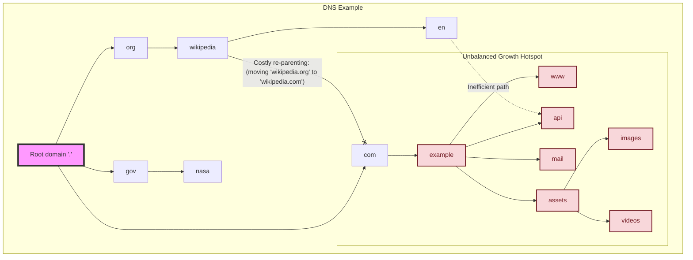
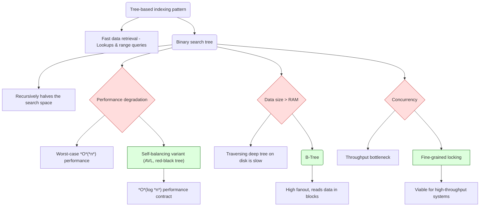
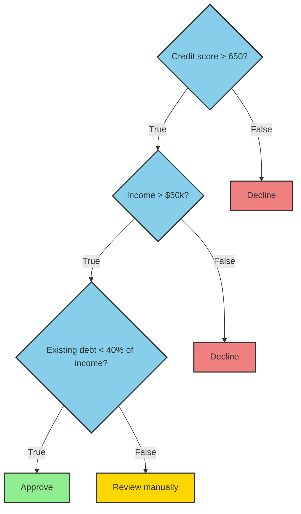
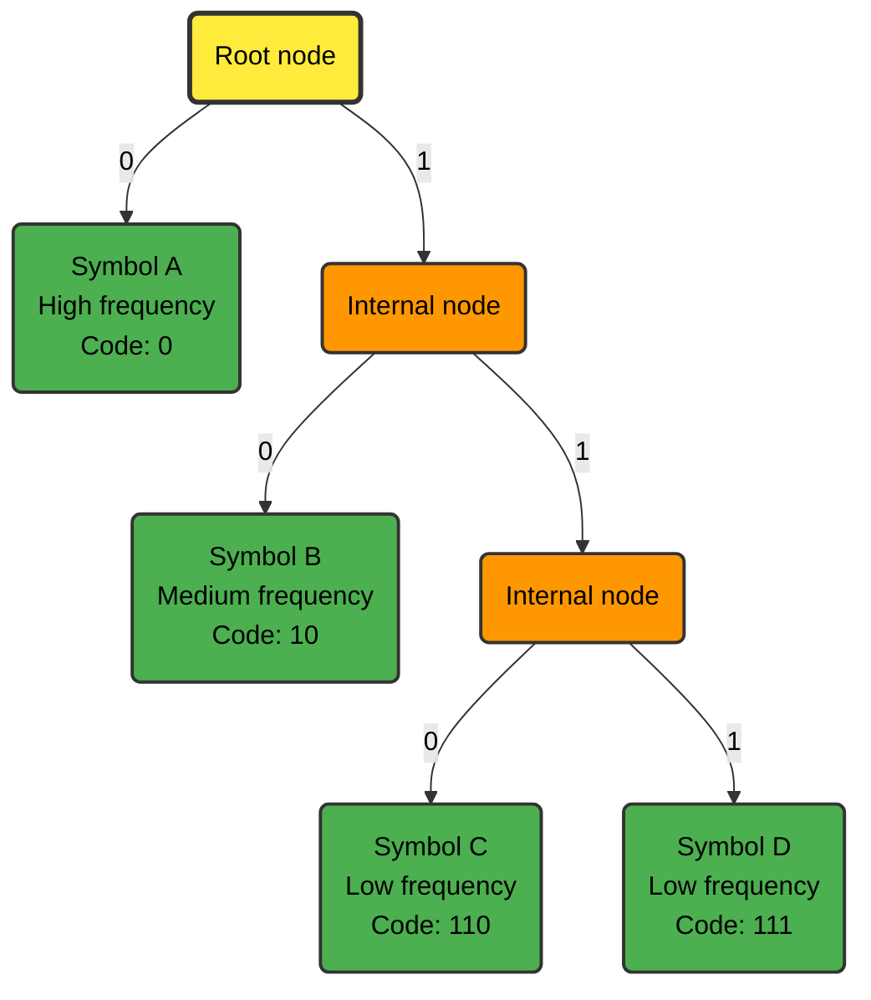

# Binary Trees

The binary tree is a computational model for **recursive decomposition**. It represents a powerful pattern for solving problems by repeatedly splitting them into two self-similar sub-problems. I analyze the application of the binary tree pattern in system architecture. I'll demonstrate how this model is used to design systems for hierarchical data management, examining each application's architectural trade-offs.

The binary tree pattern is applicable when a problem space can be recursively divided by a binary choice. A complex domain needs to be represented. A binary question is asked[^01] at each step. The answer determines which of the two sub-problems to pursue next. This process naturally evolves a binary tree, where each internal node explicates a decision point[^02] and the leaves represent the atomic outcomes. The architecture inherent to all tree-based designs is **managing the tree's balance**. An unbalanced tree can negate performance benefits and introduce systemic risks.

*Example 1*

The Domain Name System (DNS) Example (Example 1) is the most direct application, used for data that has an intrinsic parent-child relationship. Modeling file systems, organizational charts, UI component trees[^03], and geographic namespaces. Nodes maintain objects or containers, and child pointers define the hierarchy. The DNS is a canonical example, where the root domain is the tree's root, and each subdomain[^04] represents a path down the tree - an intuitive model for hierarchical data. Traversal paths[^05] map directly to tree traversal. Navigating between distant nodes[^06] is inefficient. Re-parenting large subtrees is a costly operation. Unbalanced growth[^07] creates pernicious performance hotspots.

*Example 2*

The tree-based indexing pattern (Example 2) uses a binary tree to build efficient indexes for fast data retrieval. Index a dynamic dataset within a database, search engine, or other stateful service to accelerate rapid lookups and query ranges. The search space is partitioned at each node instead of a linear scan. The classic implementation is a **Binary Search Tree** (BST). The decision at each node[^08] recursively halves the search space. A naive BST offers no **performance guarantee**. A system design **must** specify a **self-balancing variant**[^09] to enforce an $O(\log n)$ performance contract and prevent worst-case $O(n)$ degradation from non-random data patterns[^10]. This pattern is ideal for in-memory indexes. The I/O cost of traversing a deep binary tree is prohibitive for datasets larger than RAM. The pattern must then be evolved into a **B-tree**, which has a high fanout and is optimized for block-based disk reads. A simple tree index is a single point of contention. High-throughput systems require sophisticated lock-free structures to be viable.

*Example 3*

The **decision tree** (Example 3) uses a binary tree to encode a sequence of decisions. Implement machine learning classifiers. It is constructed. Each internal node constitutes a conditional test[^11], and its two children select the subsequent action or determine the next test for the true-and-false outcomes. The leaves constitute the final classification. Decision trees are highly transparent[^12], which is a major advantage for debugging business logic or complying with regulations. Complex decision trees prove brittle and difficult to update. A small change in an early rule can have cascading, unintended consequences. Traversal is very fast[^13], making it suitable for real-time decision-making applications like telephony and packet filtering.

*Example 4*

**Huffman coding** (Example 4) uses a binary tree's structure to institute a variable-length prefix code for data compression. Compress data for storage or network transmission. Huffman coding builds a binary tree based on the frequency of symbols in the input data. Frequent symbols are placed closer to the root, resulting in shorter bit codes. The path from the root to a symbol's leaf node[^14] defines its unique binary code. Highly effective for data with a skewed frequency distribution. It's a component in widely used compression standards like *gzip* and DEFLATE. The frequency table, or a smattering of metadata about the tree itself, must be transmitted along with the compressed data so the decompressor can rebuild the exact same tree. This adds a fixed **overhead** that proves counterproductive for very small payloads. It's a two-pass algorithm[^15], which isn't suitable for pure streaming apps without adaptive variants.

Naive **recursive** implementations are elegant but risk **stack overflow** if the tree becomes unexpectedly **deep**. Production systems should favor iterative solutions over recursive ones when tail-call optimization is unavailable. A shared tree structure is a bottleneck. The design must specify a **concurrency** control model:

- *Coarse-grained locking*: Simple but kills performance.
- *Fine-grained locking*: High performance but notoriously difficult to implement correctly[^16].
- *Lock-free algorithms*: The best performance, but requires expert-level knowledge.

It's better to use a pre-existing concurrent library implementation than to build one for most systems. A **serialization** format is needed to save a tree's state. A **preorder traversal** is used because it perfectly reconstructs the original tree's structure, which is critical for specific layouts.

[^01]: "Is the value less than or greater than the pivot?", "Does the item belong to the left or right half of the space?", "Is the condition true or false?"
[^02]: a partition
[^03]: DOM, React Virtual DOM
[^04]: [wikipedia.org](https://www.wikipedia.org/), [en.wikipedia.org](https://en.wikipedia.org/)
[^05]: `/home/user/file.txt`
[^06]: cousins
[^07]: one directory with millions of files
[^08]: `key < node.key`
[^09]: red-black tree, AVL tree
[^10]: a major operational risk
[^11]: "Is `packet.port == 445`?"
[^12]: "white box"
[^13]: *O*(log *n*)
[^14]: `left = 0`, `right = 1`
[^15]: first pass to calculate frequencies, second to encode
[^16]: risk of deadlocks
