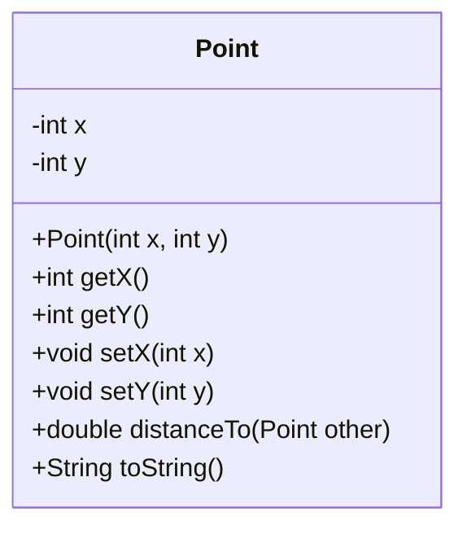
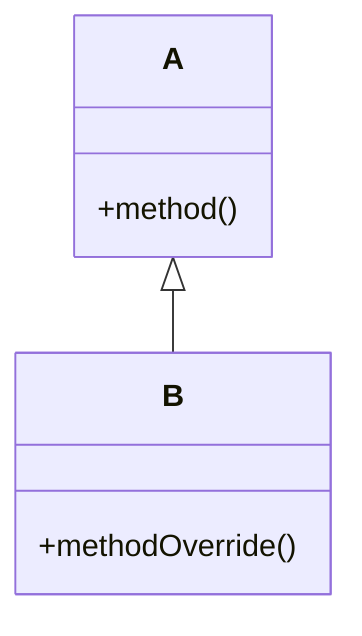
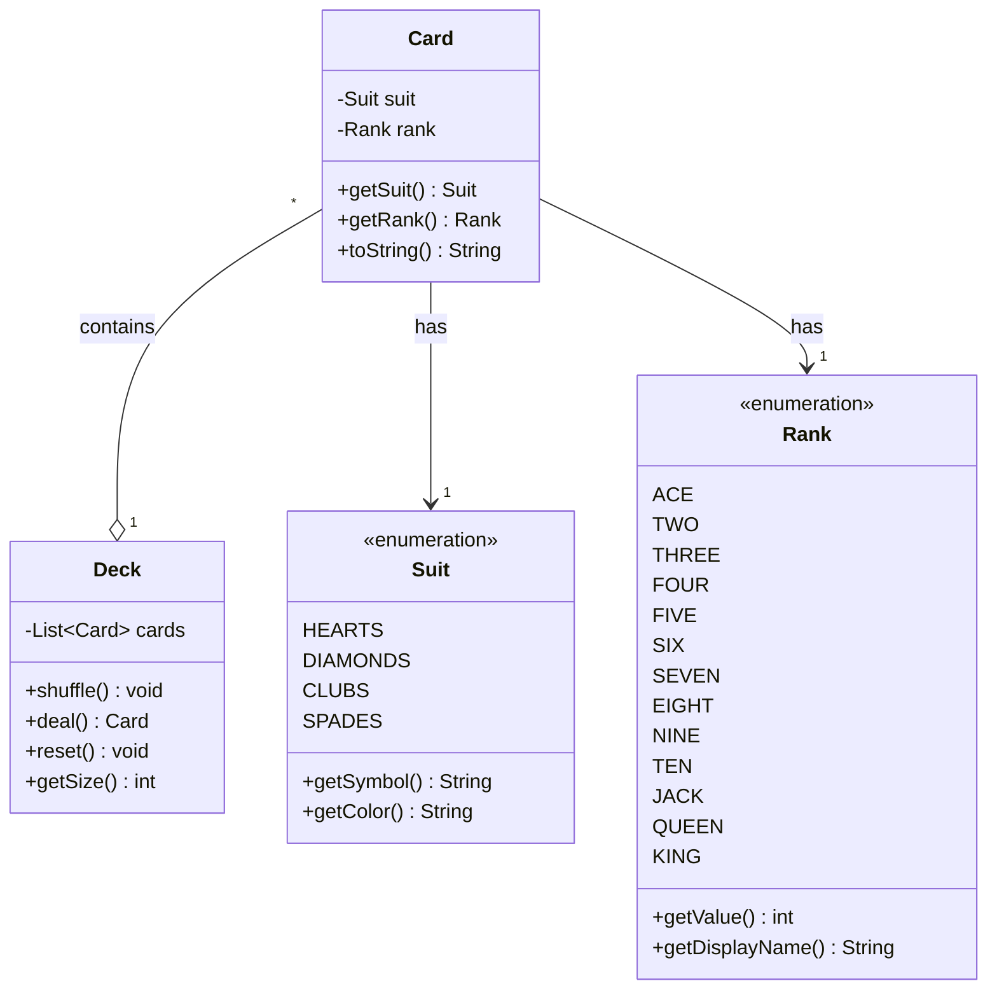
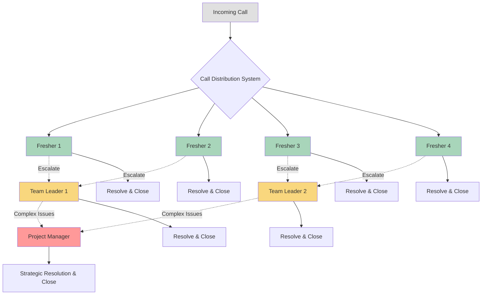
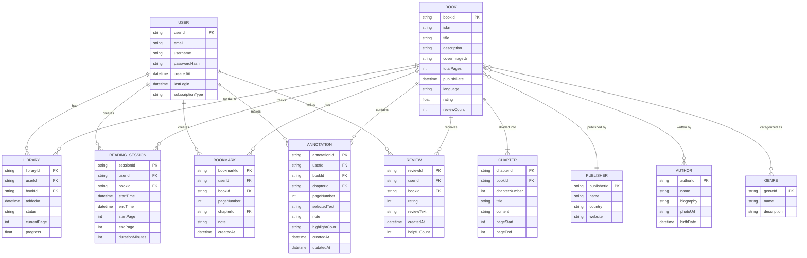

# Class Hierarchies

Object orientation revolves around **classes** and **objects**. A **class** is an abstract definition or something that has **attributes**[^1] and **actions**[^2]. An **object** is a specific instance of a class that has its own state separate from any other object instance.



This example shows **encapsulation** - the hiding of implementation details[^3].

`Point.java`

```java
public class Point {
  private int x, y;

  public Point(int x, int y) {
    this.x = x;
    this.y = y;
  }

  public Point(Point other) {
    this.x = other.getX();
    this.y = other.getY();
  }

  public int getX() {
    return x;
  }

  public int getY() {
    return y;
  }

  public Point relativeTo(int dx, int dy) {
    return new Point(x + dx, y + dy);
  }

  @Override
  public String toString() {
    return String.format("(%d, %d)", x, y);
  }

  public static void main(String[] args) {
    Point p1 = new Point(5, 10);
    Point p2 = p1.relativeTo(-5, 5);
    System.out.println(p2.toString()); // (0, 15)
  }
}

```

Inheritance allows a class to be defined as a modified or more specialized version of another. When class B inherits from class A, class A is B’s base class, and class B is A’s subclass. At the top of the hierarchy is the Shape class. The Ellipse classes could be further specialized into the Circle subclass. Polymorphism is the capability to provide multiple implementations of an action and to select the correct implementation based on the surrounding context. All the behaviors defined by class A are also part of class B in a modified form.



`Shape.java`

```java
import java.awt.Graphics;

public abstract class Shape {
  protected Point center;

  protected Shape(Point center) {
    this.center = center;
  }

  public Point getCenter() {
    return center;
  }

  public abstract Rectangle getBounds();
  public abstract void draw(Graphics g);
}

```

`Rectangle.java`

```java
class Rectangle extends Shape {
  private int w, h;

  public Rectangle(Point center, int w, int h) {
    super(center);
    this.w = w;
    this.h = h;
  }

  public Rectangle getBounds() {
    return this;
  }

  public void draw(Graphics g) {}
}

```

`Ellipse.java`

```java
class Ellipse extends Shape {
  private int a, b;

  public Ellipse(Point center, int a, int b) {
    super(center);
    this.a = a;
    this.b = b;
  }

  public Rectangle getBounds() {
    return new Rectangle(center, a * 2, b * 2);
  }

  public void draw(Graphics g) {}
}

```

Even though many shapes may be defined, the part of the app that draws them doesn’t need to do much work:

```java
void paintShapes(Graphics g, List<Shape> shapes) {
  for (Shape s : shapes) s.draw(g);
}

```
 


Think about the logic. How does a Deck shuffle? How does a Hand calculate its score?

## The Parking Lot

Track available spots, handle different vehicle types[^4], and manage specialized spots[^5].

| Objects   |
| ------- |
| ParkingLot |
| Level    |
| ParkingSpot |
| Vehicle   |

---

Use these prompts to practice your OOD skills:

1. Design the data structures for a **generic deck of cards** for particular card games.
1. Implement a `getCallHandler()`.



1. Design a musical jukebox using object-oriented principles.
1. Design a chess game using object-oriented principles.
1. **Online book reader**



1. Design the data structures to solve a jigsaw puzzle.
1. Design a chat server. Provide details about the backend components.
1. Implement the OOD for the game Othello.
1. Design the data structures for a file system. Illustrate with code examples.
1. Describe the data structures to implement a garbage collector in C++.

[^1]: properties/state
[^2]: methods/capabilities
[^3]: private fields
[^4]: Car, Bus, Motorcycle
[^5]: Handicapped
[^6]: Directories, Files
