# Compilers

## Code Execution

Code interacts with a compiler. Programming interfaces define how. **Systems programmers** work on the code that keeps computer systems running: frameworks, drivers, and compilers themselves. Other programmers are their audience, and the job involves little user interface work. **Application developers** work on the pieces that non-programmers use.


## Algorithm vs. Hardware

```mermaid
graph TB
    subgraph Setup["Problem Setup"]
        Problem["Sort 10M numbers<br/><i>n = 10<sup>7</sup></i>"]
    end
    subgraph CompA["Computer A</br>Fast hardware"]
        A_Speed["Speed: 10B instructions/sec<br/>10<sup>10</sup> instructions/sec"]
        A_Algo["Algorithm: insertion sort<br/>Complexity: <i>O(n<sup>2</sup>)</i>"]
        A_Code["Optimized by world's craftiest programmer"]
        A_Calc["Time = (c<sub>1</sub> × n<sup>2</sup>) / speed<br/>= (2 * 10<sup>14</sup>) / 10<sup>10</sup>"]
        A_Result["⏱️: 20K seconds ≈ 5.5 hours"]
        A_Speed --> A_Algo
        A_Algo --> A_Code
        A_Code --> A_Calc
        A_Calc --> A_Result
    end
    subgraph CompB["Computer B<br>Slow hardware</br>"]
        B_Speed["Speed: 10M instructions/sec<br/>10<sup>7</sup> instructions/sec)"]
        B_Algo["Algorithm: Merge sort<br/>Complexity: <i>O(n log n)</i>"]
        B_Code["Coded by average programmer (even with poor compiler)"]
        B_Calc["Time = (<i>c<sub>2</sub> × n log n</i>) / speed<br/>= (50 × 2.3 × 10<sup>8</sup>) / 10^<sup>7</sup>"]
        B_Result["⏱️: 1,163 seconds ≈ 19 minutes"]
        B_Speed --> B_Algo
        B_Algo --> B_Code
        B_Code --> B_Calc
        B_Calc --> B_Result
    end
    Problem --> CompA
    Problem --> CompB
    A_Result -.->|vs| B_Result
    subgraph Lesson[" "]
        Insight["Computer B is 1000× slower BUT finishes 17× faster!<br/>20,000 ÷ 1,163 ≈ 17.2×<br/>💡 As problem size increases, the advantage grows even more!<br/>Algorithm choice (<i>O(n log n)</i> vs <i>O(n<sup>2</sup>)</i>) beats both hardware speed AND compiler optimization"]
    end
    A_Result --> Insight
    B_Result --> Insight
    style A_Result fill:#ffcccc
    style B_Result fill:#ccffcc
    style Insight fill:#fff4cc,stroke:#333,stroke-width:3px
    style Problem fill:#e6f3ff

```



Computer B[^1] executes ${10}^7$ instructions/second and uses an inefficient compiler to run **merge sort**[^2].

## [Proebsting's Law](https://proebsting.cs.arizona.edu/law.html)

> ...while hardware computing horsepower increases at roughly 60%/year, compiler optimizations contribute only 4%. Basically, compiler optimization work makes only marginal contributions.

-- <cite>Todd Proebsting</cite>

Proebsting's observation is tantamount to the adage about writing efficient code.

## Tail-call Optimization

Modern optimizing compilers perform sophisticated transformations to improve performance. If the final action of a function is a recursive call, a good compiler transforms it into a loop. This reuses the same stack frame, preventing stack overflow and eliminating gratuitous overhead.


### Before Inline Expansion

```cpp
int square(int x) {
  return x * x;
}

```

### After Inline Expansion

```cpp
int main() {
  int result = 5 * 5;
}

```

This eliminates the overhead of the call mechanism and is safer than using C-style macros. **Strength reduction** replaces expensive operations with cheaper ones[^3]. If a value[^4] is calculated multiple times, the compiler calculates it once, stores it in a temporary variable, and reuses it. Used in Java, the **just-in-time compiler** translates bytecode into native machine code at runtime, achieving performance comparable to C++.

## Language Notes

In C, the compiler tracks the location of arrays, not their size. There's no bounds checking - the language won't complain if you store something in the 20<superscript>th</superscript> element of a 10-element array. **`volatile`** informs the compiler that the value of the variable can change from the outside[^5]. If any function of a class is declared as **virtual**, a **vtable** is constructed. The default versions created by the compiler could lead to multiple deletes. A C++ implementation should include a copy constructor and an assignment operator. Java is compiled to virtual machine **bytecode**, which requires a virtual machine to run[^6]; this gives Java portability. The Java compiler implicitly uses `StringBuffer` when `String` instances are concatenated using the `+` operator but can lead to inefficient code. For example, the code

```java
String s = "";
for (int i = 0; i < 10; s = s + i++ + " ");

```

is equivalent to creating a new `StringBuffer` inside the loop.

Modern compilers include prophylactic tools to deter buffer overflows. **Microsoft CL** uses the `/GS` flag for stack protection. **GCC** uses `-fstack-protector-all`. The compiler is a crutch. It's recommended to practice coding with pen and paper first. Use the compiler only to verify your solution after you have logically reasoned through the problem.

The most significant performance gains still come from the programmer's choice of algorithms. **Code tuning may solve a problem, but a better algorithm can redefine it.**

[^1]: slow
[^2]: 50 *n* log *n*
[^3]: replacing a multiplication inside a loop with an addition when iterating through an array
[^4]: like *x + y*
[^5]: like hardware
[^6]: JVM
