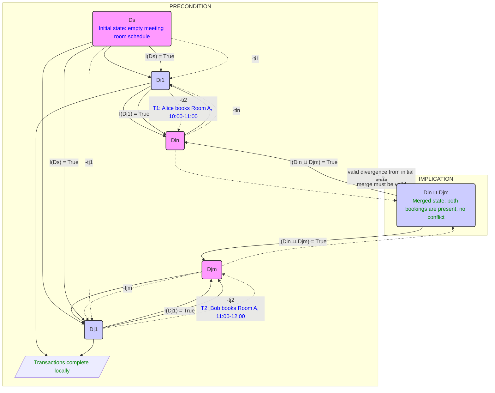
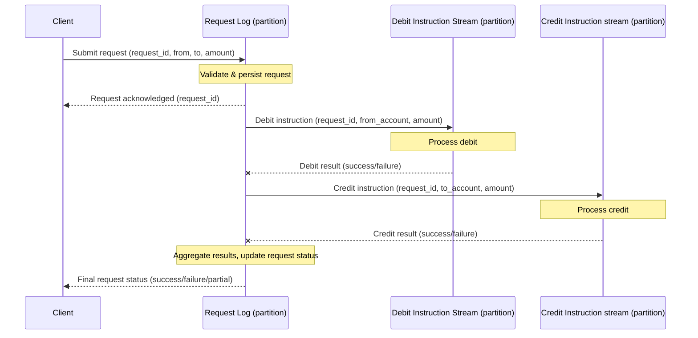

# Designing a System under Certain Constraints

Let's start with a summary of what eventual consistency is and what its limitations are. Eventually consistent systems in the style of Amazon Dynamo are designed to be fast and highly available during failures, even when parts of the system fail. We're guaranteed that all copies of data will converge to the same state at some future point. However, this puts the burden of handling temporary inconsistencies on the app. Here are some examples of guarantees that eventual consistency can't provide:

- *Key uniqueness*: If we can't guarantee uniqueness of email addresses registered with accounts, one email address may get attached to two accounts.
- If **check-and-set** is done by reading and then writing, the order of updates between competing writers may not be the same on all storage nodes. This means that there will be a temporary disagreement.
- *All-or-nothing updates*: If there's a network partition and the coordinator's write request only succeeds on one out of three storage nodes, the client will receive a response indicating partial success.
- *Read-your-write consistency*: The writes succeed in the zone that accepts the write. Readers in other zones aren't guaranteed to see the writes.

We're given these limitations of eventual consistency. How can we design a system that does enforce uniqueness constraints and maintain high availability?

To characterize coordination avoidance, we need a system model. We're aiming for a system with these key properties:

- *Global validity*: Invariants hold over committed states.
- *Transactional availability*: We guarantee a response.
- All copies of data in a distributed database will **converge** to the same state at some future point in the absence of any changes.
- *Coordination-freedom*: Transactions shouldn't have to communicate during transaction execution

We're trying to build a system where data is replicated across many servers, transactions can happen on any server without talking to others, and yet we can guarantee that our data remains consistent and that all servers eventually agree.

Our **database** as a collection of data items[^01]. Each has multiple versions. App clients submit requests to the database in the form of transactions, or groups of operations[^02] that should be executed together. Each transaction operates on a logical **replica**, or set of versions of the items mentioned in the transaction. Transactions operate over "snapshots” of database state. Upon commit[^03], the replica state is **merged** into the set of versions on at least one server. We assume this merge operator is commutative, associative, and idempotent. For example, if server

$R_x = \\{v\\}$

and

$R_y = \\{w\\}$

then

$R_x \sqcup R_y = \\{v, w\\}$

To determine whether a database state is valid according to application correctness criteria, we use **invariants**. You need usernames to be unique. Other kinds of constraints are very similar: An account balance never goes negative, a meeting room doesn't have overlapping bookings. A transaction can commit, or abort[^04] if committing the transaction would violate a declared invariant over the replica state of its set of transactions $T$. A transaction can only abort if it explicitly chooses to abort itself or if committing would violate invariants over the transaction's replica state. A system is convergent iff, in the absence of new writes, the servers eventually contain the same version for any item they both store. We apply the merge operator to produce a convergent state. A system provides coordination-free execution for $T$ iff the progress of executing each $t \in T$ is only dependent on the versions of the items $t$ reads[^05]. That is, in a coordination-free execution, each transaction's progress towards commit/abort is independent of other operations[^06] being performed on behalf of other transactions.

If $\mathcal I$-confluence holds, there exists a correct, coordination-free execution strategy for the transactions. Two servers have independently made changes that are individually correct[^07]. Can we always merge those changes and still have a correct state? A set of transactions $T$ is $\mathcal I$-confluent with respect to invariant $\mathcal I$ if, for all $\mathcal I-T$-reachable states $D_i, D_j$ with a common ancestor state, $D_i \sqcup D_j$ is $\mathcal I$-valid. Under $\mathcal I$-confluence, the states produced by these sequences[^01] must be valid under merge.

*Figure -1*

*Theorem 1*: A globally $\mathcal I$-valid system can execute a set of transactions $T$ with coordination-freedom, transactional availability, convergence if and only if $T$ is $\mathcal I$-confluent with respect to $\mathcal I$.

The theorem establishes $\mathcal I$-confluence as necessary and sufficient for coordination-free execution. If $\mathcal I$-confluence holds, there exists a correct, coordination-free execution strategy for the transactions; if not, no possible implementation can guarantee these properties for the provided invariants and transactions.

$\rightarrow$ If $\mathcal I$-confluence holds, each server can independently check if a transaction violates the invariant based on its local replica. There exists a coordination-free execution strategy for the transactions.

$\leftarrow$ If we have coordination-freedom, $\mathcal I$-confluence must hold. The forwards direction uses a partitioning argument to derive a contradiction. $\bot$ To prevent invalid states, at least one of the transaction sequences will have to forgo coordination-freedom.

Writes are performed in the same, well-defined order[^09]. The merge procedures[^10] are deterministic so that servers resolve the same conflicts in the same manner. The Bayou system uses a primary commit scheme. One server designated as the primary takes responsibility for committing updates. The primary is responsible for deciding the final order of committed operations. **Truncating the logs** guarantees that they can catch up with the latest state. As a multi-tenant database, [Manhattan](https://blog.x.com/engineering/en_us/a/2014/manhattan-our-real-time-multi-tenant-distributed-database-for-twitter-scale) needs to provide high quality of service to each customer without overwhelming the log.

*Example 1: Handling a money transfer*

Apply every request exactly once to both the payer and payee accounts. We can consider more complex invariants, such as **foreign key** constraints. Insertions are $\mathcal I$-confluent, while deletions are more challenging[^11].

[^01]: like rows in a table
[^02]: reads and writes
[^03]: succeeds
[^04]: reject it
[^05]: *t*'s replica state
[^06]: writes, locking, validations
[^07]: according to our invariants
[^08]: *D<subscript>in</subscript>* and *D<subscript>jm</subscript>*
[^09]: first tentative, then committed
[^10]: and dependency checks
[^11]: cascading deletes can maintain *I*-confluence
