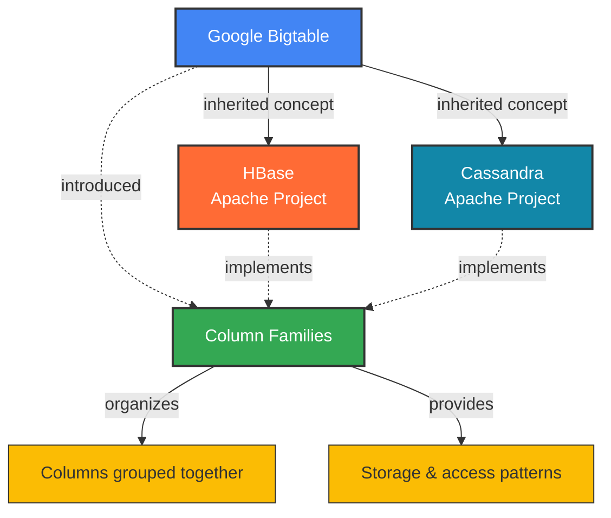
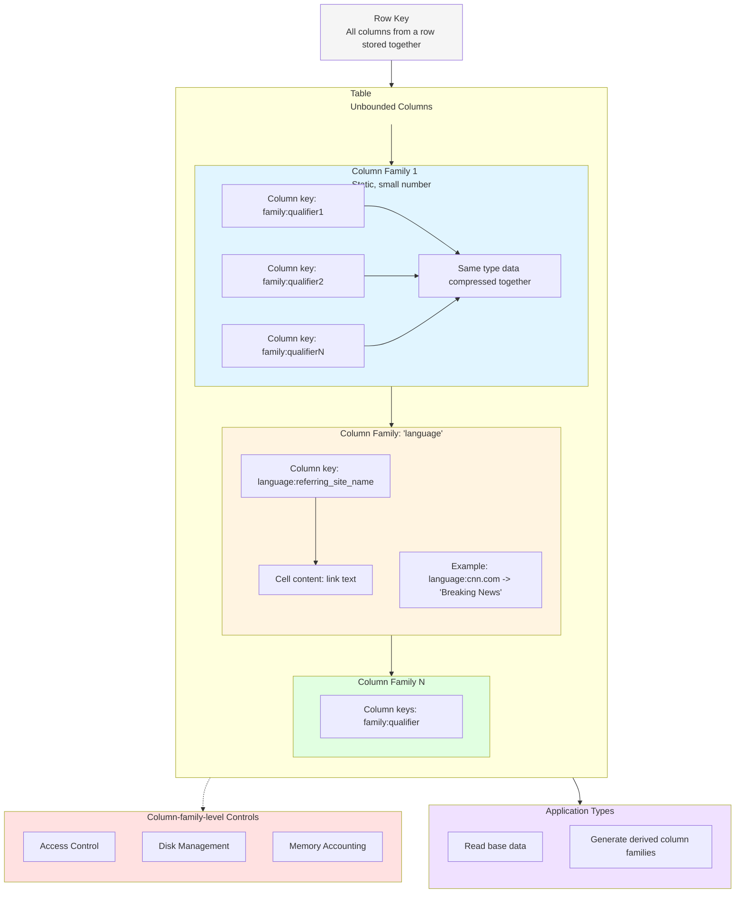
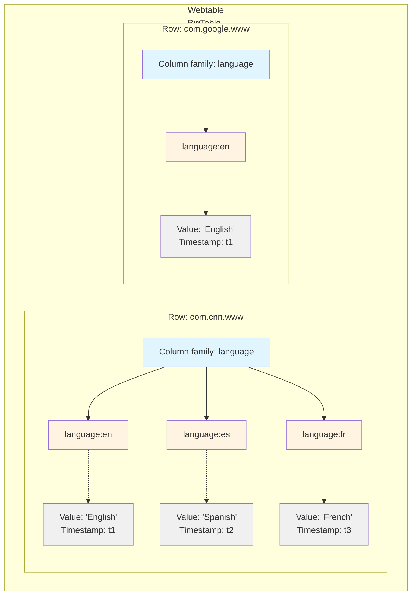

# A Distributed Hash Table System

## Column Families in Databases

It's misleading to call Cassandra and HBase column-oriented. The Bigtable model is mostly row-oriented.

Each column key in the **anchor family** represents a single anchor. These controls allow us to manage applications that add new base data and read-only applications with restricted visibility[^1].

[^1]: excluding certain families for privacy reasons
