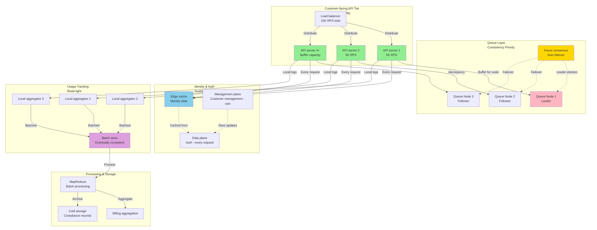
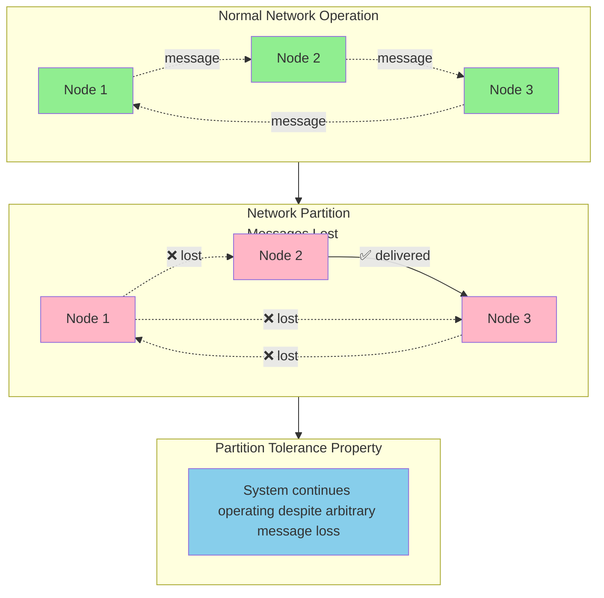
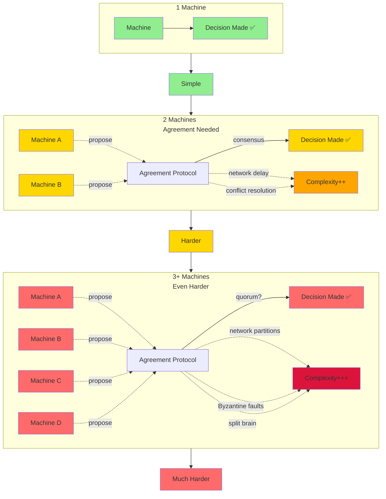
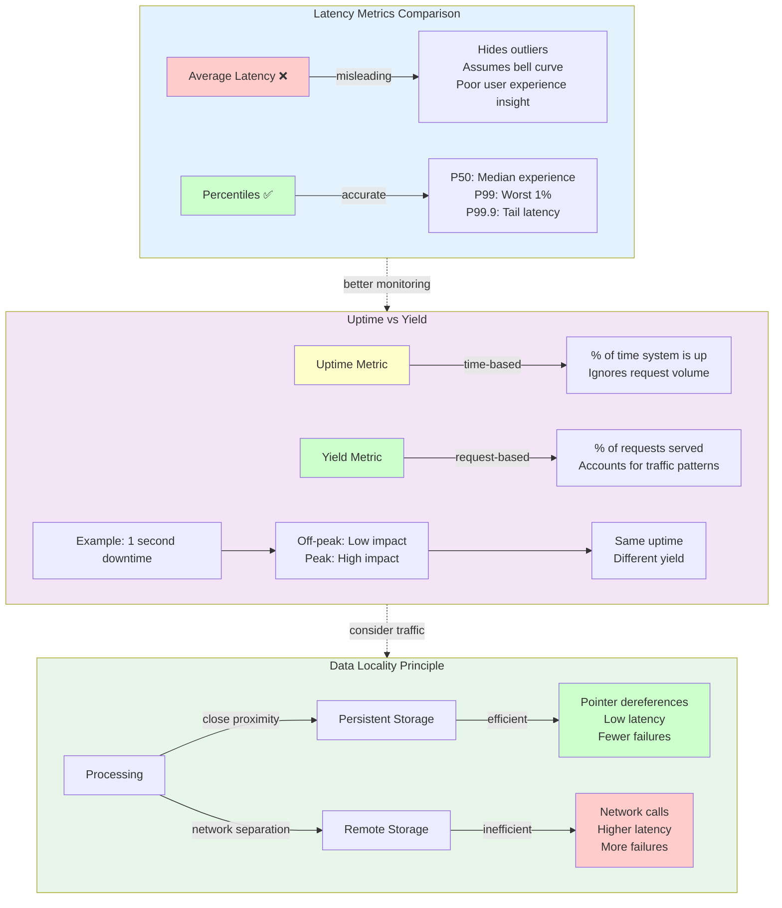

# Distributed Systems

## The Reality: From Theory to Architecture

<blockquote>
	Hey I just met you
	The network's laggy
	But here's my data
	So store it maybe
</blockquote>

— <cite>**Kyle Kingsbury**, *Carly Rae Jepsen and the Perils of Network Partitions* (2013)</cite>

A recurring theme is how systems handle things going wrong - for example, replica failover, replication lag, and concurrency control. Working with distributed systems is fundamentally different from writing software on a single computer. We'll now turn our pessimism to the max. Experienced operators assume that anything that can go wrong will go wrong. Dealing with failures explodes the possible state space that needs testing and validation. It doesn't make sense to expect a single-node database to be fast if its disk system gets really slow. Semi-failures are common. The core argument that gets used for these systems is that if a node has a probability $P$ of failure and if the software can replicate data $N$ times to survive $N - 1$ failures, then the probability of losing a particular piece of data is $P^N$. So for any desired reliability $R$ and any single-node failure probability $P$, you can pick some replication $N$ so that

$$P^N < R$$

**which is hogwash**. The reasoning assumes failures are independent. Failures are correlated. Identical hardware runs on the same power supply. The same bug exists on all the machines. One client sends corrupt requests; it's able to sequentially bring down all the servers. When you push the **bad config**, it's game over no matter how many machines you push it to. There's really only one thing to talk about with respect to reliabiity: continuous hours of successful production operations. I call this **empirical** reliability[^01].

A common term that applies to distributed-system architecture is service-oriented architecture (SOA). While SOA may conjure memories of WS-standards and the nebulous Common Object Request Broker Architecture, the core idea is solid: loosely coupled services, each serving a small function and working independently from one another.
For each of the services identified, you must consider the following items:

1. Is the service global or regional?
1. Is it single-tenant or multi-tenant?
1. What are the guarantees for availability, latency, throughput, consistency, and durability?
1. How is IAAA (identity, authentication, authorization, and audit) considered?
1. How is billing for quota limits performed?
1. How will updates to the system be deployed?

To illustrate these principles, consider a service that resizes images. Although it seems trivial, operating this at scale disabuses engineers of any optimism; the inherent complexity of distributed systems is ineluctable.

100K users; 10K requests per second (RPS) per region. The 99<superscript>th</superscript> %ile of latency should <500ms for images <1MB in size. The system provides 99.9% availability. The service should offer a usage-based pricing model[^02], so it needs to keep track of the amount of CPU time required to convert an image and its size.

Assume an average of 256KB per image, so the system can process 10 conversions per second per CPU core. We need **1K cores** to support 10K RPS. We need ~32 servers using 32-core machines. Adding 20% headroom for surges, we require a fleet of $\geq 40$ **dedicated processing systems**. This scale confirms that a simple single-server monolith is impossible; we need a distributed stack.

Figure 1 breaks the system down into a few coarse services:

*Figure 1*

1. Since the business wants 99.90% availability from the system, let's set a goal for the customer-facing API tier[^03] at 99.99% percent availability.
1. We need at least three servers[^04]. They handle the 10K RPS load with 5K RPS per server.
1. We need a buffer because there's a scale discrepancy between the fast API servers and the slower processing cores. We must choose between consistency and availability according to the CAP theorem. Most queues prioritize **consistency**[^05]. We must automate leader election and failover using Paxos to meet high availability. Manual failover is too slow to meet a 99.90% SLA.
1. Customer management[^06] happens rarely, but **authentication** happens on every request. We decouple the management plane from the data plane. We cache **identity** data at the edge. This favors **availability** over **consistency**[^07], but the system must remain fast.
1. **Usage** tracking is the inverse of the API: it's read-light. Perform local aggregation of logs on the API servers, then ship them in batches to an eventually consistent store[^08]. Use a MapReduce or batch-processing system to aggregate this data for billing and move raw records to cold storage[^09] for compliance.

Distributed systems are the default approach to scaling, but no one benefits from irrational exuberance. It takes about a decade for a file system to mature. Good software can't run reliably with bad **operations**. Check invariants[^10]. If you have a NoSQL vendor, ask for the observed real-life distribution of MTTF and MTTR.

## Engineering

When you're writing a program on a single computer, it behaves predictably: it either works or it doesn’t. The same operation produces the same result[^11] if the hardware is working correctly. If there's a hardware problem (e.g., memory corruption), the consequence is usually a total system failure[^12]. An individual computer is either fully functional or entirely broken. In distributed systems, we're no longer operating in an idealized system model. We confront the messy reality of the physical world when you're writing software that runs on several computers connected by a network. What sets distributed systems engineering apart is the **probability of partial failure**. If a mutex unlock fails, we can assume the process is unstable and crash it. But the failure of a distributed unlock must be built into the lock protocol. You may not even know whether something succeeded, as the time it takes for a message to travel across a network is non-deterministic!

I've seen a number of distributed databases describe themselves as being CA[^13] while not providing partition-tolerance - a solecism that indicates that the developers don't understand the CAP theorem. Under the **consistency** guarantee[^14], each operation looks as if it were completed at a single instant. This is equivalent to requiring requests of the distributed shared memory to act as if they were executing on a single node. For a distributed system to be **available**, every request received by a non-failing node must result in a response[^15].

*Figure 2*

When a network is partitioned, all messages sent from nodes in one component of the partition to nodes in another component are lost.

**You can't choose CA** for a distributed system. It would need to run on a network which is guaranteed to never drop messages and whose nodes are guaranteed to never die. These types of systems don't exist.

Atomic consistency is expected by most web services. That said, the universe doesn't permit consistency which is both instantaneous and global. Information has an upper limit to the speed it can travel[^16]. The goal is to push consistency breaks down to a point where we no longer notice it. Just don't try to act outside your own light cone. The trick of horizontal scalability is **independence**.

*Figure 3*

Standard database replication isn't strongly consistent. Special logic must be introduced to handle replication lag. Paxos is very hard to implement. Avoid coordinating machines wherever possible.

Design for failure. I've dealt with switch failures, PDU failures, accidental power cycles of racks, and even a hypoglycemic driver smashing his pickup truck into a HVAC system. Backpressure is one of the basic building blocks of creating a robust distributed system. It's the signaling of failure from a serving system to the requesting system. Implementations of backpressure involve either dropping new messages or shipping errors back to users. Timeouts and exponential back-offs are essential. Without backpressure, cascading failure becomes likely.

*Figure 4*

**Harvest** is the fraction of the data that was reflected in the result. For example, if a search engine queries three shards[^17] but Shard B is down, returning results only from A and C gives you a **67% harvest**. A partial answer[^18] is better than no answer[^19] for many businesses.

Your system will have to make a choice between **reducing yield**[^20] and **reducing harvest**[^21]. You're always building a **partition-tolerant** system. Decide now how you'll handle the moment the lights go out.

[^01]: as opposed to theoretical reliability
[^02]: requires precise CPU/size tracking
[^03]: the front door
[^04]: plus headroom
[^05]: FIFO ordering
[^06]: creating accounts
[^07]: a new user might have to wait a few seconds before his credentials work
[^08]: a Dynamo-style key-value store
[^09]: tape or low-cost disk
[^10]: "Are all messages sent actually received?"
[^11]: determinism
[^12]: a kernel panic of Blue Screen of Death
[^13]: consistent and available
[^14]: atomic/linearizable
[^15]: not an error or timeout
[^16]: the speed of light
[^17]: A, B,and C
[^18]: reduced harvest
[^19]: reduced yield
[^20]: stop answering
[^21]: give incomplete answers
