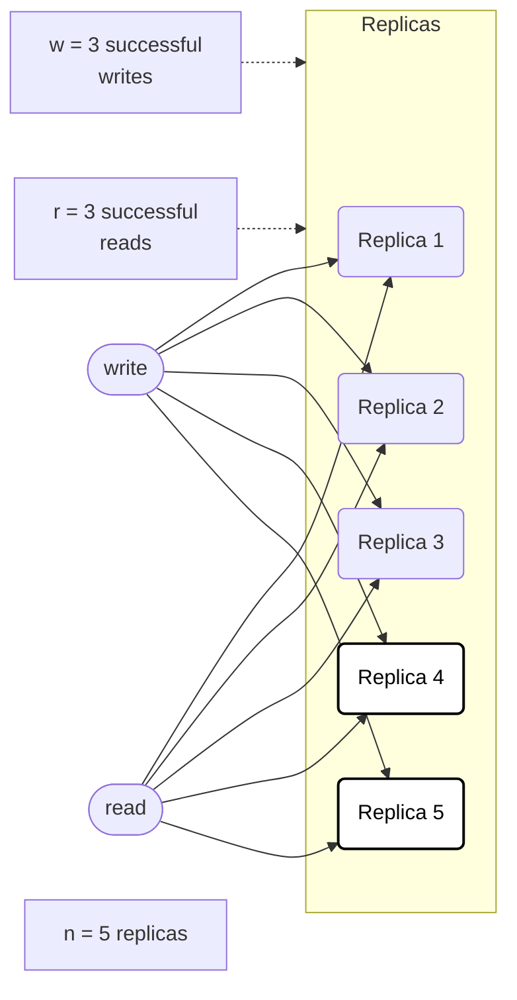

# Limitations

It's **important to monitor** whether your databases are returning up-to-date results even if an app can tolerate stale reads. Your replication should alert you so that you can investigate the cause[^1] if it falls behind. You can measure replication lag by subtracting a follower's position from the leader's. Monitoring is more difficult in leaderless replication because there's no fixed order in which writes are applied. There has been some research on measuring staleness depending on `n`, `w`, and `r`, but it's not yet a common practice. Eventual consistency is a vague guarantee. For operability, it's important to **quantify "eventual."**

*Figure 1*

Dynamo-style databases are optimized for eventual consistency. The parameters `w` and `r` allow you to adjust the probability of stale values being read, but it's wise to not take them as absolute guarantees. Stronger guarantees[^2] generally require transactions or consensus.The set of nodes to which you've written and the set of nodes from which you've read must overlap. It's not clear which write happened "before" another without a mechanism to determine the order of **concurrent writes**[^3]. If the "last write wins," writes can be lost due to clock skew. In this case, it's undetermined whether the read returns the old or the new value. It could break the quorum condition. Even if everything is working correctly, there are edge cases in which you can get unlucky with the timing.

Riak is based on Dynamo. Riak intends to add support for **strict quorums** with PW/PR turns out to have a corner case where the guarantees aren't enforced. Riak optimizes for **"always writable" over "read-your-own-writes"** consistency. A **write failure** in Riak doesn't mean the value won't later show-up in a read. You may eventually read it through read repair.
WARS models only a **single write and read**. It's a conservative estimate for multi-write scenarios.

WARS (write-after-read staleness) treats each distribution as **independent and identically distributed**.

WARS **doesn't capture effects of common anti-entropy processes** (e.g., read-repair[^4], Merkle-tree exchange[^5]). WARS doesn't address system behavior under **failures**[^6], which varies. It **assumes that clients contact a coordinator** server instead of issuing requests themselves. There are plenty of append-only data stores[^7]. They all suffer from compaction-related performance issues.

**Clients requiring staleness detection may do so asynchronously**, enabling speculative reads and compensatory actions.

**The data structures you query** are used in Datomic and, to some extent, CouchDB. Compaction and garbage collection become crucial. Old versions must eventually be cleaned up. RethinkDB's "young blocks" subsystem[^8] mitigates this. The LSM tree approach offers high write throughput. There are no silver bullets. Achieving good performance requires an enormous amount of tuning work to get everything right. Getting purge/compaction right is a hard engineering problem. Immutability needs additional disk space.

Truly deleting data is surprisingly hard, since copies can live in many places, and backups are often deliberately immutable. You sometimes have to try. Data protection legislation may require erroneous information to be removed. **Humans** need a "snapshot," rather than noisy real-time data changes.

XA transactions introduce operational problems. If the transaction coordinator isn't replicated, it's a **single point of failure** for the entire system. Many coordinator implementations aren't highly available by default or only have rudimentary replication support. The coordinator's logs become a crucial part of the durable system state - as important as the databases themselves. Such app servers are no longer stateless. XA is necessarily the **lowest common denominator**. For example, it can't detect deadlocks across different systems, and it doesn't work with serializable snapshot isolation. The tendency to **amplify failures** runs counter to building fault-tolerant systems. There are alternative methods that allow us to achieve consistency across systems without the pain of heterogeneous distributed transactions.

[^1]: network issues, overloaded nodes
[^2]: such as read-your-writes, monotonic reads, or consistent prefix reads
[^3]: like vector clocks or a globally consistent timestamp, which introduces its own challenges
[^4]: inconsistencies are corrected during reads
[^5]: used for efficient data synchronization
[^6]: node failures, network partitions
[^7]: LSM trees, CouchDB, Datomic
[^8]: which prioritizes recently-updated blocks
