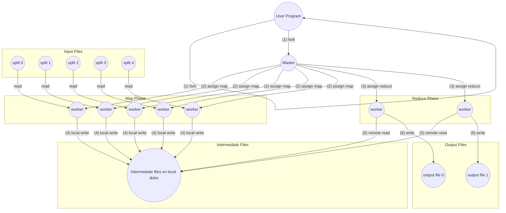
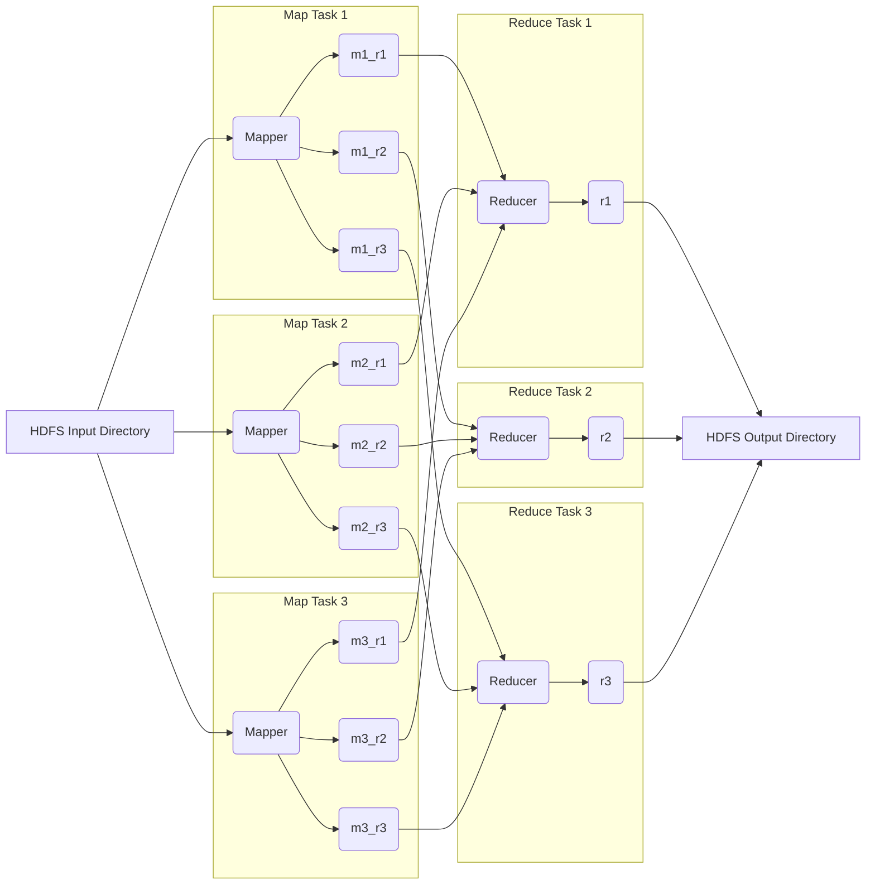

# MapReduce

## The Programming Model

MapReduce is a programming model and associated implementation designed for processing and generating large datasets that may not fit in the memory of a single machine. It simplifies distributed data processing by handling the complexities of parallelization, data distribution, fault tolerance, and load balancing. It allows programmers to utilize resources on large clusters of commodity machines without any experience in distributed systems. Users specify two functions, `map` and `reduce`.

A computation takes a set of input key-value pairs and produces a set of output key-value pairs. The user expresses the computation as two functions:

- **`map`**, written by the user, takes an input pair and produces intermediate key-value pairs. Think of this as transforming and extracting relevant data from each input record.
- The **`reduce`** function merges together all intermediate values associated with the same intermediate key, typically aggregating, summarizing, or filtering them, to produce zero one output values.

Programs written in this functional style are automatically parallelized and are fault-tolerant. Many real-world tasks, such as counting word occurrences in a large document collection, building inverted indexes, or analyzing web server logs, are expressible in this model. Although MapReduce's importance is declining, it provides a clear picture of why and how batch processing is useful. It was a major step forward in terms of the scale of processing that could be achieved on commodity hardware.

## Example: Word Count

```cpp
map(String docName, String docContent):
  for each word w in docContent:
    EmitIntermediate(w, "1");

reduce(String word, Iterator values):
  int result = 0;
  for each v in values:
    result += ParseInt(v);
  Emit(AsString(result));

```

The `map` function emits each word plus a count of `1` in this example. The `reduce` function sums together all counts emitted for a particular word.

## Types

Even though the previous pseudocode is written in terms of string inputs and outputs, the `map` and `reduce` functions have associated types:

- `map (k1, v1) -> list(k2, v2)`
- `reduce (k2, list(v2)) -> list(v2)`

That is, the input keys and values `(k1, v1)` are drawn from a different domain than the output keys and values. The intermediate keys and values `(k2, v2)` are from the same domain as the output keys and values. The C++ implementation leaves it to the user code to convert between string and appropriate types.

## More Examples

| Example | `map` emits                     | `reduce`                                         |
| ---------------- | ---------------------- | ---------------------------------------------- |
| distributed grep       | a line if it matches a pattern    | is the identity function[^01]                     |
| count of URL access frequency | `<URL, 1>`          | adds the values for the same URL |
| reverse web-link graph     | `<target, source>` for each link | concatenates the list of source URLs associated with a target     |
| term-vector per host     | `<hostname, term_vector>`     | adds the term vectors together for a given host              |
| inverted index        | `<word, documentID>`         | `reduce` sorts corresponding document IDs and emits `<word, list(documentID)>` |
| distributed sort       | `<key, record>`           | emits all pairs unchanged[^02]                         |

## Implementation and Execution

An implementation of MapReduce is targeted to large clusters of commodity PCs connected via switched Ethernet. in the environment:

1. Machines are typically dual-processor x86 machines with 2-4 GB of RAM running Linux.
1. Commodity hardware[^03] is used, averaging less overall bisection bandwidth.
1. A cluster contains hundreds or thousands of machines, and therefore failures are common.
1. Storage is provided by inexpensive IDE disks directly attached to machines, managed by a distributed file system that uses replication for fault tolerance.
1. Users submit jobs to a scheduling system that maps tasks to available machines.

## Execution Overview



*Figure 1*

The execution of a MapReduce operation proceeds as follows[^04]:

1. The input data[^05] is split into *M*[^06] independent chunks. This allows for parallel processing. It then starts multiple copies of the program on the cluster. One copy is the master, which assigns tasks to worker processes.
2. The library creates *M* `map` tasks and *R* `reduce` tasks. These tasks are assigned to worker machines in a cluster. A worker assigned a `map` task reads the corresponding input split, parses key-value pairs, and calls the user-defined `map` function for each pair. Intermediate key-value pairs are buffered in memory.
3. The master assigns idle workers either a `map` or a `reduce` task.
4. Periodically, buffered pairs are written to the worker's local disk, partitioned into *R* regions[^07]. The locations of these files are sent to the master.
5. When a `reduce` worker is notified by the master about the locations of intermediate files, it uses remote procedure calls to read the data from the `map` workers' local disks. After reading all its intermediate data, the `reduce` worker sorts it by the intermediate keys. If the data is too large for memory, an external sort is used.
6. Each `reduce` task receives an intermediate key and an iterator over the set of values associated with that key. The `reduce` worker iterates over the sorted intermediate data. The iterator allows processing of value lists that are too large to fit in memory. The user-defined `reduce` function is applied to produce the final output. For each unique key, it passes the key and the corresponding set of values to the user's `reduce` function. The output of the `reduce` function is appended to a final output file for that `reduce` partition. When all `map` and `reduce` tasks are complete, the master wakes up the user program. The output is available in *R* output files[^08]. These files are often used as input to another MapReduce job or another distributed app.

## Master Data Structures

The master keeps data structures to store the state[^09] and worker identity for each `map` and `reduce` task. It stores the locations and sizes of the *R* intermediate file regions produced by the completed `map` task. The information is pushed to in-progress `reduce` tasks.

## Fault Tolerance

MapReduce is designed to tolerate machine failures gracefully.

- The master pings workers periodically. If **a worker fails**, any completed `map` tasks are reset to idle and rescheduled. In-progress `map` and `reduce` tasks on the failed worker are also reset. Completed `map` tasks are re-executed because their output is on the failed machine's local disk. Completed `reduce` tasks don't need re-execution since their output is in the global file system.
- The master writes periodic checkpoints. **Master failure** is unlikely[^10]; therefore an implementation would abort the computation. Clients can retry the operation.
- *Semantics in the presence of failures:* When `map` and `reduce` operators are deterministic, the output is the same as a non-faulting sequential execution. This is achieved by relying on atomic commits of task outputs. Each task writes to private temporary files. When a task completes, the worker sends a message to the master. When a `reduce` task completes, the worker atomically renames its temporary file. When operators are non-deterministic, weaker but reasonable semantics are provided.
- Network bandwidth is a scarce resource. MapReduce conserves bandwidth by taking advantage of the fact that input data is stored on the **local** disks of the machines. The master attempts to schedule `map` tasks on machines containing a replica of the input data, or failing that, near a replica.
- *Task granularity:* The `map` phase is divided into *M* pieces, and the `reduce` phase into *R* pieces. Ideally, *M* and *R* should be much larger than the number of worker machines to improve load balancing and speed up recovery. There are practical bounds on *M* and *R* since the master must make $O(M + R)$ decisions and keeps $O(MR)$ state in memory.
- *Backup tasks:* To alleviate the problem of "stragglers"[^11], the master schedules backup executions of remaining in-progress tasks close to completion. The task is marked as completed when either the primary or backup execution completes.

## Refinements and Extensions

Although the basic MapReduce functionality is powerful, a few extensions are useful.

- Users specify the number of `reduce` tasks (*R*) and, optionally, a special *partitioning function.* The default is `hash(key) mod R`, but custom functions are useful in some cases[^12].
- *Ordering guarantees:* Within a partition, intermediate key-value pairs are processed in increasing key order. This makes it easy to generate sorted output and supports efficient lookups.
- For cases with significant repetition in intermediate keys and a commutative and associative `reduce` function[^13], a **combiner function** can do partial merging before data is sent over the network. This significantly reduces network traffic. The combiner function is typically the same code as the `reduce` function, but its output is written to an intermediate file.
- Users can add support for a new **input type** by providing an implementation of a simple reader interface.
- Users of MapReduce have found it convenient to produce auxiliary files as additional outputs. The application writer to make such **side-effects** atomic and idempotent.
- *Skipping bad records:* In an optional mode, the MapReduce library detects and skips records that cause deterministic crashes. This deals with bugs. Also, sometimes it's acceptable to ignore a few records.
- *Local execution:* To help facilitate debugging and testing, an alternative implementation sequentially executes a MapReduce operation on a local machine.
- *Status information:* The master runs an internal HTTP server and exports status pages showing bytes of output, processing rates, etc. They also link to standard error/output files.
- A **counter** facility counts occurrences of events[^14]. Counter values are propagated to the master and displayed on the status page. The master eliminates the effects of duplicate executions to avoid double-counting.

## Usage and Lessons Learned

MapReduce has been used across a wide range of domains, including:

- large-scale machine learning
- clustering problems
- data extraction for reports
- large-scale graph computations

MapReduce's success is attributed to its ease of use, its applicability to a large variety of problems, and its scalable implementation. Restricting the programming model makes it easy to parallelize and to make computations fault-tolerant. Network bandwidth is a scarce resource. Locality optimizations allow us to read data from local disks, and writing a single copy of the intermediate data to local disk saves network bandwidth. Redundant execution can reduce the impact of slow machines and handle failures.

---



The input is typically a directory in Hadoop Distributed File System. The mapper is run for each input file. The output consists of key-value pairs. Key-value pairs are partitioned by `reducer`[^15], sorted, and copied from mappers to reducers, then to the distributed file system. It's common for MapReduce jobs to be chained together into workflows, such that the output of one job becomes the input to the next. Hadoop doesn't have workflow support; chaining is done implicitly by directory name. MapReduce jobs are less like Unix pipelines. Unix pipelines use small in-memory buffers.

[^01]: simply passes the input through
[^02]: relying on MapReduce's partitioning and ordering
[^03]: 100 Mbits/s or 1Gbit/s at the machine level is used
[^04]: referring to the numbered steps in Figure MR-1
[^05]: often stored in file
[^06]: typically 16-64 MB each
[^07]: determined by a partitioning function, often `hash(key) mod R`
[^08]: once per reduce task
[^09]: idle, in-progress, completed
[^10]: due to there being only one master
[^11]: slow tasks
[^12]: ensuring all URLs from the same host go to the same reducer
[^13]: like word count
[^14]: total words processed
[^15]: using a hash of the key
